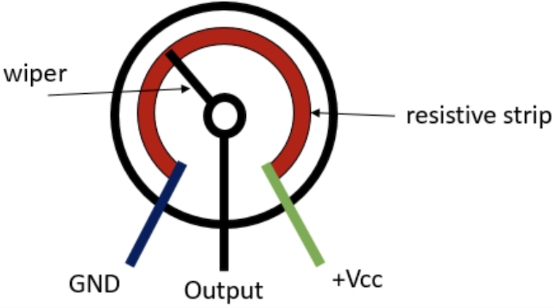
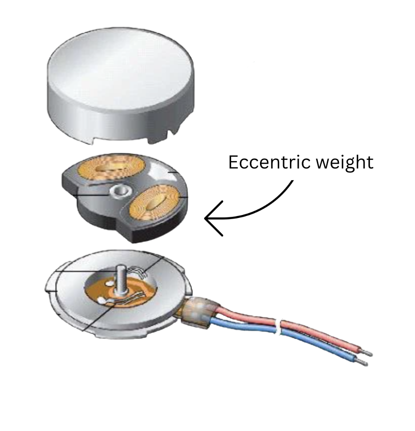
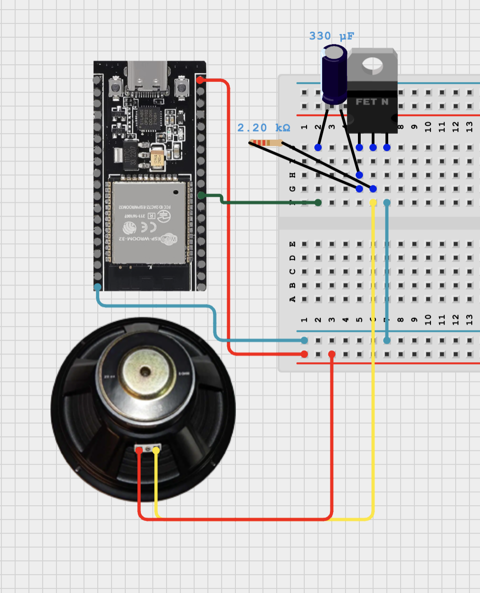
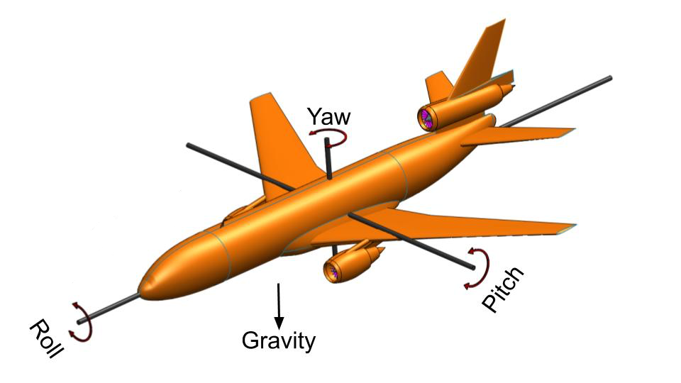
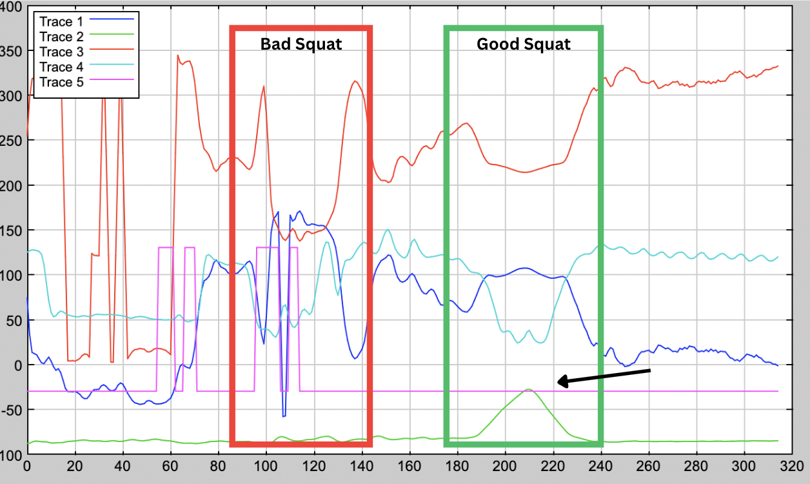
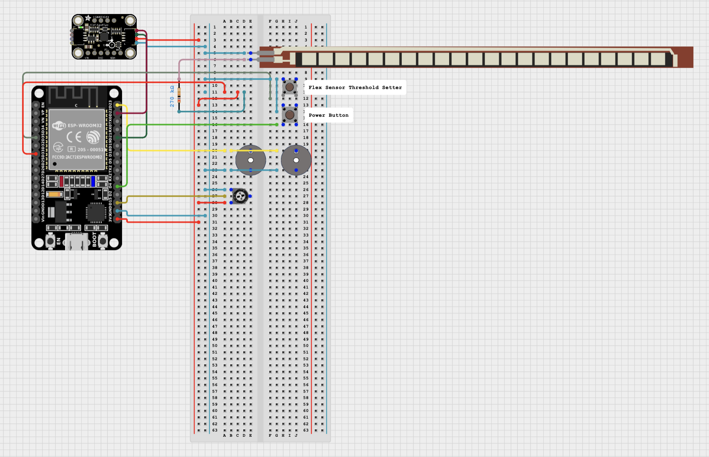
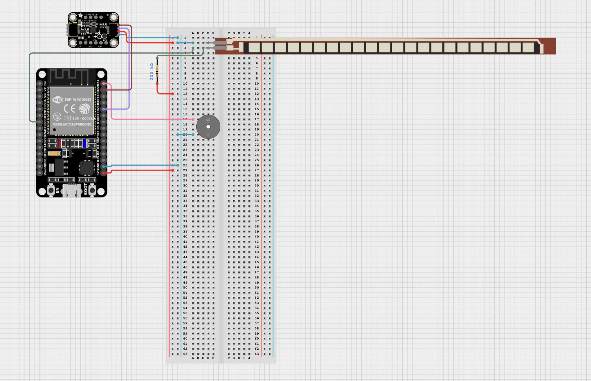

# Knee Rehabilitation Device

My project is a device that goes on your knee to make knee rehabilitation easier, safer, and more enjoyable. It has modes to track different exercises like squats and wall sits, plays music, and even has captivating LEDs. It incorporates lots of cool data science, computer science, and electrical engineering. All of this is controlled by the user through a Bluetooth interface where they can give simple commands from things like setting the music or finding the angle their knee is at.

| **Engineer** | **School** | **Area of Interest** | **Grade** |
|:--:|:--:|:--:|:--:|
| Alika G | Woodside Priory | Electrical Engineering | Incoming Junior


# How the components work

## Flex Sensor:


<div align="center"> 
  
  <i>Figure 1: Diagram of how a flex sensor's resistance changes from Aarav G's Instructables article (linked below)</i>
</div>

A flex sensor is a variable resistor. When bent, the conductive particles spread apart, increasing the resistance as seen above (Figure 1). When reading in an Arduino, it is important to use analogRead rather than the conventional digitalRead used for reading most Arduino inputs. analogRead reads the voltage along a scale, unlike digitalRead, which only returns high or low. Because we want to measure all the small changes in resistance, and since resistance impacts the voltage, for a flex sensor, we need to use analogRead.

## Finding a resistor for the flex sensor:

While you can use a variety of resistors for a flex sensor, some will give you a better range than others. From Ohm's law, we know we can write Vin/Vout as $$\frac{R_{1}}{R_{1}+R_{2}}$$, and in this case, the flex sensor is R<sub>2</sub>. I then measured the flex sensor's resistance with a multimeter when it was flat and bent to get its low and high resistances. I wanted to optimise for the largest range, so I wanted to have the highest difference between the ratios of Vin/Vout at the flex sensors' low and high resistance. This makes the equation $$\frac{x}{x+240}-\frac{x}{x+300}$$ (Figure 2). Taking the derivative of that, we can find a critical point that is a maximum at $$\sqrt{240\left(300\right)}$$, which is about 268.32. All the measurements are in 1k ohms, so based on these calculations, I chose a 270k ohm resistor.

<div align="center">
  
</div>

<div align="center"> 
  
  <i>Figure 2: A graph from Desmos of resistor values (x-axis) against the range of analog flex sensor values that the resistor would allow</i>
</div>

## Regression:

I used regression to convert the flex sensor's raw value to degrees. After trying many types of regression, I ultimately went with a linear regression, which was pretty accurate for when the knee was 0 to 180 degrees, with less accuracy as you approach the end of that range. Regression means turning a scatter plot into an equation by finding the line of best fit. I did this on Desmos, as it lets you easily toggle between different types of regression. I wanted an R-squared value over 0.95 (R-squared is a metric to see how well the line of best fit fits the points), and I was only able to get that with linear, quadratic, or quartic regression. Quartic wasn't very helpful since I have too few points, so while it was hitting every point, the graph was a bit wonky. Quadratic was the clear best, but because quadratic functions aren't one-to-one, it was creating some difficulties. Linear was both accurate and what the flex sensors regression is supposed to be, between 0 and 180 degrees, according to documentation, so that's what I ended up using (Figure 3).


<div align="center"> 
  
  <i>Figure 3: Final graph of linear regression from Desmos</i>
</div>

## Digital Biquad Filter:

In an effort to make my flex sensor data more consistent, I explored ways to create a low-pass filter. The goal of this is to push frequencies past a certain threshold to zero. The first step was recording the raw, unaveraged data from the flex sensor. I used a discrete fourier transform (see MATLAB Code for the discrete Fourier transform in Appendix A) to plot a sample of this data when my knee was at 90° for a few seconds. This data was plotted in magnitude with respect to frequency, meaning it tells you what frequencies are represented in the data and how much of each frequency is there (Figure 4).
<div align="center">
  
</div>

<div align="center"> 
  
  <i>Figure 4: Graph of magnitude of frequencies when holding my knee at 90°, generated with MATLAB</i>
</div>

Based on that graph, I decided the cutoff frequency should be 1 Hz. Deciding the cutoff is a tradeoff between getting rid of variability and still registering significant movements. After 1 Hz, there is a lot of noise (random spikes), and it isn't too low that it would cut off somewhat quick movements, so that seemed like an ideal starting cutoff. I also experimented with a 0.7 Hz cutoff. I then used a computer to model what the filter looked like (Figure 5) and find the right coefficients. 
<div align="center">
  
</div>

<div align="center"> 
  
  <i>Figure 5: Graph of the biquad filter I used, generated by earlevel's biquad calculator. The first Y axis is the magnitude in dB, and the Y axis on the right is for the green line, which is phase measured in radians, the x axis is frequency for both</i>
</div>

A biquad filter uses 6 coefficients: b<sub>0</sub>, b<sub>1</sub>, b<sub>2</sub>, a<sub>0</sub>, a<sub>1</sub> and a<sub>2</sub>. Figure 6 shows all the values that go into getting your output (y[n]) from your input (x[n]). In a biquad filter, you also store and use the past 2 input and output values. In the diagram, going back an iteration is represented with z<sup>-1</sup>. All the arrows in the diagram mean multiplication, and the + symbols mean addition. see [Wikipedia on Digital Biquad Filters](https://en.wikipedia.org/wiki/Digital_biquad_filter) for a more indepth explanation.
<div align="center">
  
</div>

<div align="center"> 
  
  <i>Figure 6: Flow chart of a biquad filter in direct form 1 from Wikipedia</i>
</div>

> Note: I took all my data and did all my filtration after the linear regression, but since it is a linear regression, you can do it either way.

## Piezo Buzzers:
Piezoelectric Buzzers work by rapidly vibrating a disc of piezoelectric material at a high frequency. Piezoelectric just means it changes shape when electricity is applied to it.

## Potentiometer:
Potentiometers are basically variable voltage dividers. As seen in Figure 7, potentiometers have 3 pins, with pins 1 and 3 (ground and power) connected by a resistive strip. That means the resistance between them doesn't change. Pin 2, however, is connected to a wiper that can slide to touch any point on the resistive strip. This means the resistance between the power and pin 2 can change as the amount of the resistance strip between them changes (with more of the resistive strip meaning more resistance). The voltage that goes to pin 2 changes as the resistance changes, in an inverse relationship, just as with the flex sensor. Pin 2 is connected to an analog pin (see the flex sensor section) on the Arduino, which then measures this change, providing a value from 0 to 4095.

<div align="center">
  
</div>

<div align="center"> 
  
  <i>Figure 7: A diagram of a potentiometer from Random Nerd Tutorials</i>
</div>

## Vibration Motor:
I wanted to create a silent mode that still provided the user with feedback, so I decided to use a vibration motor. There are multiple types of vibration motors, but the type that I chose is the most common. It is called an Eccentric Rotating Mass (ERM) vibration motor, and as the name suggests, it vibrates by rotating a mass. The mass is uneven, so as the mass is rotated at a fast speed, the motor moves in a vibrating motion. I used a coin or pancake-style motor, so unlike larger ERMs, you can't see the mass, but you can see Figure 7 for the structure under the cap. This type of motor is often used for haptic feedback in small devices, like it is in mine.
<div align="center">
  
</div>

<div align="center"> 
  
  <i>Figure 8: The structure of a coin ERM motor from [I need motors](https://www.ineedmotors.com/vibration-motor/coin-vibration-motor/worlds-smallest-erm-motor.html) modified on Canva</i>
</div>

## Speaker:
I decided to add a speaker to my project. To test this out, I made a circuit on the breadboard (Figure 8) and some test code just for it (see Speaker Test Code in Appendix A).
<div align="center">
  
</div>

<div align="center"> 
  
  <i>Figure 9: schematic of my test circuit for the speaker, made on Cirkit designer</i>
</div>

To wire this circuit, I needed a transistor, a capacitor, an ESP-32, in addition to the speaker. This is because the speaker needs a lot more amps than the ESP-32 can give, so we need a transistor to work as an amplifier. The resistor I used was a 2.2K ohm resistor, but you can vary the resistor depending on the desired volume (with a resistance and volume having an inverse relationship). The way this works is the ESP has the ability to make perfect sinusoidal signals, so that signal is created and passed through the capacitor to filter out the constant. The capacitor acts as a filter, and similarly to taking the derivative of a sinusoidal function, is able to preserve the shape of the signal while removing the offset. The signal then goes to the base pin of the transistor. Transistors have 3 pins: base, collector, and emitter. The base is like the gate that dictates the flow of current from the collector to the emitter. The base value is very small comparatively, as that is what is coming from the ESP's analog pin, rather than the current going through the speaker. The 5V power goes to the speaker directly and then exits to the transistor's collector pin. That then goes through the transistor to its emitter pin, ending at ground. There is also a feedback loop, where the base and collector pins are connected through a resistor, so the current from the collector pin is reduced by the resistor and fed back into the base pin, which "opens the gate" to a stable amount of current flow.

## Running two loops concurrently:
I wanted to run two loops in true parallel (not just switching between them really fast), so my normal code could run while the speaker played music, which is called multitasking. To do this, I used FreeRTOS(free real-time operating system) in the regular Arduino IDE. More technically, multitasking means you create 2 independent tasks and then run them on the same or different cores. Lucky for me, ESP-32s have 2 cores: core 0 and core 1. My first step was figuring out what core my code was currently running on. To do this, I added `Serial.println(xPortGetCoreID());` to the end of the main loop. This told me that my knee rehab code was running on core 1 (which is the default for Bluetooth, which I use). Next, I created my task as seen below:

```
void SpeakerLoop(void* pvParameters){ 
  while(true){
    // actual code for the task (what would be in void loop(){here} ordinarily)
  }
}
```
The formatting for this second task is a bit different than Arduino's default `void loop()`: first, the name has to be different to distinguish it from the main loop; second, you need to have the parameter `void* pvParameters` because it is passing in a address and FreeRTOS reguires it even if it is null; and lastly we need a `while(true){}` loop because otherwise the task will just finish once it reaches the end of the code. It is also important to note that while this is written like a function, if we want to use it as a task, it HAS to have void as the return type and a void* for a parameter.

Next, we want to take this SpeakerLoop function and make it a task pinned to the core not in use (in this case, core 0). The code below (placed in setup) accomplishes that.
```
  xTaskCreatePinnedToCore (
    SpeakerLoop,     // Function to implement the task
    "MusicTask",     // Name of the task
    4096,            // Stack size in bytes
    NULL,            // Task input parameter
    0,               // Priority of the task
    NULL,            // Task handle
    0                // Core where the task should run
  );
```
The first two parameters are pretty straightforward. The stack size is how much space/memory you are giving to the task. All the variables specific to that task will be put "on top of the stack" (or actually bottom because stacks build down). The return addresses or functions, and various other things, also go on the stacks. What I did to choose the size was to start small and then just increase the size until I wasn't getting stack overflow or stack canary errors. It is convention to use powers of 2 for the bytes (a byte is just 8 bits) that you specify. The next line is the pointer parameter we are passing in (the void* pvParameters from earlier), but since I'm not using it, I just put NULL. Priority tells the computer that if it has a conflict between two tasks, which one to choose. 0 is the highest priority. The priority doesn't matter too much in this case because the two tasks aren't really interacting, they are running on different cores, and neither will be that problematic if they are delayed by a very small amount of time. The task handle is the pointer (points directly to the address) or handle (an abstract reference managed by a separate system) for the task it is creating. I didn't need one, so I just put NULL. Finally, it needs the number of the core I am pinning it to, which is 0. If you want more information on this, I recommend looking at [How to Write Parallel Multitasking Applications for ESP32 using FreeRTOS & Arduino](https://www.circuitstate.com/tutorials/how-to-write-parallel-multitasking-applications-for-esp32-using-freertos-arduino/). Also, an important thing to remember is you need to add the volatile keyword before any variable accessed by multiple tasks/cores. In general, you want to have as little information as possible accessible to both, so I'm only having a boolean and a byte (instead of an int because ints are 4 bytes).

## Creating your own library:
I wanted to keep my code cleaner, so when I realized I would need huge arrays of the notes and durations of each note for every song I wanted the user to be able to play, I decided to make my own music library. The way libraries work in C++ is that they are effectively just pasted in, so the code is pretty much the same. I created a file on TextEdit and then converted it from .rtf (rich text format) to .h (header). IMPORTANT: when converting your .h file will look the same, but when you actually open up the code of it, there  will be random remnants from rtf trying to tell you the lost information, just delete that, otherwise it will throw errors. Then just drag the file into the folder of the project you are working in (in Documents/Arduino) next to the .ino file. In your .ino (regular code) file, include the name of your library, in my case `#include "Music.h"`. Then you are free to code in your library, just remember that it needs to be able to compile by itself, so if you are adding functions, you might need to pass in pointers. To pass a pointer to a function, put &variableName, because, unlike Java, if you just put the name of the variable, it is not a pointer but the information (rvalues) of the object. To declare an input parameter a pointer for something, put variableType *variableName. 

> Note: to see the music.h library, go to the music library section in Appendix A

## Neopixel Strip:
A Neopixel strip is just a bunch of Neopixels chained together. Each Neopixel has a red LED, green LED, and blue LED that shine at different brightnesses to make a rainbow of colors. Each Neopixel receives 3 bytes of information (8 bits for each color) on its data pin and gets 5V from its power pin, with its last pin being ground. These pins of each Neopixel are attached together in a Neopixel strip. You just need to connect the wires from the neopixel at the start end, with power to the ESP-32's Vin, ground to ground, and the data pin to one of the digital pins on the ESP-32. I then tested the strip with some basic code (see Neopixel Strip Test Code in the Appendix A) before integrating it into my project. 

## Accelerometer:


<div align="center">
  
</div>

<div align="center"> 
  
  <i>Figure 10: </i>
</div>

### Converting acceleration to orientation
While you can try to detect good vs. bad squats with acceleration, it's not very consistent, as I saw when I originally tried. The problem is that acceleration is dependent on how fast you move, so while having a certain Z-axis acceleration on a slower squat would mean you had bad form, having that same acceleration on a faster squat would be fine and expected, even with perfect form. To address this, I used my accelerometer to instead describe its 3D orientation. To do this, I used Euler angles. These are measurements of rotation often used to describe the 3D orientation of an object, like the nose of a plane. As seen in Figure 11, each measures rotation along a specific axis: roll measures along the longitudinal axis, pitch along the lateral axis, and yaw along the perpendicular axis.

<div align="center">
  
</div>

<div align="center">
  
  <i>Figure 11: a diagram of the axis of roll, pitch, and yaw from [smlease](https://www.smlease.com/entries/mechanical-design-basics/what-is-the-difference-between-roll-pitch-yaw-aircraft-motions/).</i>
</div>

To convert this data, I used a Madgwick filter, which takes in the accelerometer and gyroscopes' readings on all three axes to find the values of roll, pitch, and yaw. Arduino has a `MadgwickAHRS.h` library that does this. A Madgwick filter basically uses the data from the gyroscope, which measures rotational motion, to try to make a quaternion (a more complex way of noting orientation than Euler angles, but less susceptible to gimbal lock, which is when you lose a degree of freedom). The filter then uses that to predict the direction of gravity and compares those values to what the accelerometer provides, and uses that to incrementally fix the filter, in what's called a gradient descent, which helps reduce gyroscope drift over time. The library then has functions to get the pitch, roll, and yaw from the quaternion. 

### Calibration
Now that I had my Euler angles, I moved to finding out how to detect a bad vs a good squat. Arduino has an in-built serial plotter, but it is very limited, so I used CoolTerm as my serial plotter. I plotted 5 variables (or traces) while a person with the compression sleeve on did good or bad squats. Based on this, I choose thresholds for the buzz variable to "beep" by switching to a value of 130. To see the code I used, look for Testing Accelerometer Calibration Code in Appendix A. I did this over a decent course of time. You can see an example of how the data looked in Figure 12.

<div align="center">
  
</div>

<div align="center"> 
  
  <i>Figure 12: A graph of printed values with respect to when they were printed, made with CoolTerm's serial plotter. Modified to show when the user was performing a good and a bad squat. The traces correspond to variables as follows: 1 is roll, 2 is pitch, 3 is yaw, 4 is the angle of the knee, and 5 is buzz (with -30 symbolizing the buzzer off and 130 symbolizing it on)</i>
</div>

As you can see, roll and yaw (blue and red) were not very consistent. By far the best measure of whether a squat was occurring was, expectedly, the angle of the knee (cyan). I also noticed that the pitch (green) was the best indication of a good vs. bad squat. As you can see in the figure, during a bad squat, the pitch remained roughly flat, while on a good squat, the pitch significantly rose (look at the arrow). Using the angle of the knee in conjunction with pitch, in a nested if statement, to distinguish bad and good squats worked successfully, as seen by the fact that the buzz (magenta) only went up for the bad squat.

<!-- # Final Milestone

<iframe width="560" height="315" src="https://www.youtube.com/embed/F7M7imOVGug" title="YouTube video player" frameborder="0" allow="accelerometer; autoplay; clipboard-write; encrypted-media; gyroscope; picture-in-picture; web-share" allowfullscreen></iframe>

My final milestone wasn't very technologically complex, but was honestly one of the most frustrating yet important to finish: sewing and soldering. I started with soldering. I first moved the connection from my breadboard to my first PCB, which was honestly pretty relaxing. Next, I plotted out where on the sleeve I wanted things to be. I knew I wanted the flex sensor in the back, for the best readings, and the PCB on the outer side for easy access to the buttons and potentiometer. I also wanted the LED on the top, where it would be easily visible, and the accelerometer on the upper outer thigh, as that is where you get the most change in data when squatting. Based on these restrictions, I figured out where the rest of the components needed to be placed. Next, I sewed a pouch for the battery pack, and added  Velcro on it and the knee compression sleeve to make it detachable. This means you can get rid of the bulkiest item if you aren't using it, or attach it elsewhere. It also allows the user to replace or recharge the battery pack easily, without having to worry about the whole device. I then finalized and soldered my second PCB. This PCB was much harder as it was very small and was a bad quality flex PCB, with traces that were only on one side and easily lifted off. It also didn't have pre-made connections like the first PCB. I then moved on to sewing. I sewed all the components in through their holes (I made loops for the flex sensor, and attached the speaker to foam with two-part epoxy adhesive and then sewed the foam in). 

I also had to recalibrate my flex sensor and accelerometer. My flex sensor might have needed some minor recalibration regardless, but somehow it managed to break. It was drifting a lot and maxing out values, so I ended up needing to replace it. However, the replacement was providing wildly different values, so I re-did the linear regression. The accelerometer was doing fine, but the detections of bad squat form weren't very consistent, so I switched to using roll, pitch, and yaw (as mentioned above in the accelerometer section of How the components work).

One major challenge I was having was solder joints coming apart. While this was somewhat annoying in the start, it was a pretty easy fix originally. It also wasn't happening much while all the components were just sitting on the table. When I ended up sewing them, that's when many of the connections broke, and because the boards were sewn on, I had to replace them with surface mounts. The issue was that when you take the sleeve off or put it on, it stretches, and that was stressing the joints. I tried to prevent this by unplugging the connections that often came out when transferring the sleeve, but a few times I accidentally forgot or would make adjustments to the sleeve position, and some connections broke. In the end, I got so fed up that I decided to epoxy all the connections on my main PCB. That mostly fixed the problem, except for one joint, where the epoxy held the solder joint, but the joint just broke higher in the wire. After soldering that joint back together, everything held. Another challenge was that I accidentally hurt my knee during the recalibration of the accelerometer. When I fell, I accidentally damaged my ESP-32 and had to ultimately switch to a new one.

- A summary of key topics you learned about + challenges

After Bluestamp, I hope to continue with engineering, using what I learned here to make my own projects (and troubleshoot them).

-->

# Modifications
My modifications included:
- Making a Bluetooth user interface and adjusting most things to be customizable through it
- Adding a speaker and getting it to run in parallel with my regular code
- Creating a wall sitting mode
- Adding a neopixel strip with status bar and pastel rainbow modes 
- Adding assorted small components: Vibration Motor, Potentiometer, Power Button, Angle level button, Second Buzzer

## Making a Bluetooth user interface and adjusting most things to be customizable through it
Rehab is a very dynamic process; it is based on your needs and abilities in the moment. I wanted to address this by letting the user choose things like at what angle a squat is complete. After that, I just kept wanting to add more customizability, like muting the buzzer, and as I started adding other components, things like switching music. I ended up with over 25 commands for the user to call through Bluetooth. The fundamental structure of the commands is: the Bluetooth sends individual decimal values of the input to the computer, then it gets converted to a string, then that string is made all lowercase and passed through an if-else ladder of all the possible commands (and a command not found error as the else). The user can type menu to see all the possible commands and their explanations (the error statement and typing hi or hello all direct you to the menu).

A challenge I encountered in this portion of the project was that at one point, the Bluetooth would randomly disconnect and not be able to print the menu or else commands. It turned out that these were two separate issues. First, the inability to print the menu was because the Bluetooth can only take a certain number of print statements in succession (~ 15) before it's too much for it. The solution was pretty simple and just involved putting multiple lines of printing into one statement and just using `\n` to separate new lines. The second problem was much more confusing to solve. Ultimately, adding a `continue;` to the end of every if, else if, or else statement in the if-else-if ladder for Bluetooth fixed it.

## Adding a speaker and getting it to run in parallel with my regular code
I decided that it would be fun to have music playing (and I wanted to learn how to make an audio amp), so I wanted to add a speaker. I first made the circuit and ran test code (see Speaker section in How the components work). As I was transferring the speaker's music code to my main project, I realized the delays of the speaker would mess the whole project up, so I researched how to run things in parallel and ended up successfully using FreeRTOS to do this (see Running two loops concurrently section in How the components work). I then added some basic commands like play and pause music, but I still wanted to add more customizability. This would be very bulky to just add into my code, so I created a separate library for it instead (see the Creating your own library section in How the components work). I then added Bluetooth commands to do things like change songs or see what song is playing.

## Creating a wall sitting mode
Wall sits were probably the most helpful exercise for my knee. I asked my PT if I could only do one exercise consistently, which one should I do, and she said wall sits. Adding a wall sit mode was pretty straightforward. Once you start the wall sit, it just stops when it detects you get up (simple for the user), and it beeps when you finish your goal. You can set your goal, start the wall sit, and get your time at any point. 

## Adding a neopixel strip with status bar and pastel rainbow modes 
I was pretty familiar with neopixels going into this (See the Neopixel Strip section of How the components work for details). I just wanted to add neopixels for a status bar, but then I realized I can only have a status bar when the user is in counting squats or wall sitting mode, so I decided to add a looping pastel rainbow for fun in the off time. The user can turn the strip on and off, but the status bar mode is automatically engaged and disabled.

## Adding assorted small components: Vibration Motor, Potentiometer, Power Button, Angle level button, Second Buzzer
These were all pretty easy to add. They are all easily accessible on the main PCB. The Potentiometer, Vibration Motor, and Buzzer have sections in How the components work. The buttons work by connecting when you push down, sending a high signal to the Arduino. 


# Second Milestone

<iframe width="560" height="315" src="https://www.youtube.com/embed/kZ0Yr-viwl8?si=Qh_XLWgTdqZkQEg_" title="YouTube video player" frameborder="0" allow="accelerometer; autoplay; clipboard-write; encrypted-media; gyroscope; picture-in-picture; web-share" referrerpolicy="strict-origin-when-cross-origin" allowfullscreen></iframe>

My second milestone consisted of attaching the device to a knee brace (in a temporary manner) and calibrating the threshold values for the sensors based on that. I also added averaging for the sensor data so it would be more consistent and precise. You can choose how many values to average in a moving average (right now it is set at 50). I was able to attach everything with rubber bands and took some time to find the best placement for the flex sensor, which I determined to be under the knee, since it was the most accurate (see Second milestone code in Appendix A). There weren't too many technical changes from the first milestone. I also added a button to change the threshold of the flex sensor, a power button, and a potentiometer that changes the frequency of the beeps. 

I had a lot of trouble with the regression for converting the flex sensor's raw value to degrees. I tried linear, quadratic, exponential, and logarithmic regressions. In the end I decided that the regression wouldn't work because only the quadratic regression had a pretty high R squared value (it was ~0.99 compared to the ~0.89 of the rest) and since quadratic equations aren't one-to-one, solving for x in terms of y gave me two seperate equations, which I couldn't put together in a peacewise function without it failing the vertical line test. I also tried flipping the x and y values, but then none of the regressions were accurate. Ultimately, I shifted that to a system with 4 pre-set flex sensor threshold levels, where the user could choose between them with a button. 

Next, I hope to get an accurate linear regression and use more advanced averaging or filtering techniques to get more consistent data. I also hope to incorporate more of a user interface-starting with buttons and later potentially having the user be able to input commands from their phones to the device. For example, for the flex sensor threshold levels, right now they are controlled with a button that just cycles through 4 preset values but hopefuly I can make it so in the bluetooth monitor the user can type in something like "Angle threshold: 75" and that would set the device to beep when the knee is at 75 degrees. Overall, my next steps are going to focus on modifications as the base part of my project is done. My 3rd milestone will be sewing and soldering everything, so I want to finish all the additional circuitry or parts my modifications might need before then.


<div align="center"> 
  
  <i>Figure _: A schematic of my circuitry at milestone 2, made on Cirkit designer</i>
</div>

# First Milestone

<iframe width="560" height="315" src="https://www.youtube.com/embed/xQuDBH7mC_g?si=Wa5gteVYbsMu8dR0" title="YouTube video player" frameborder="0" allow="accelerometer; autoplay; clipboard-write; encrypted-media; gyroscope; picture-in-picture; web-share" referrerpolicy="strict-origin-when-cross-origin" allowfullscreen></iframe>

My project is a knee rehabilitation device. It has two main sensors: an accelerometer and a flex sensor. An accelerometer keeps track of the static acceleration values, and the flex sensor uses variable resistance to measure the angle of bend. It uses these sensors to alert the user (with a buzzer) if their knee is bending inwards or once it passes 90 degrees. 

In my first milestone, I was able to put together the flex sensor, accelerometer, buzzer, and ESP-32 Arduino with a breadboard. I was able to get data from the flex sensor and accelerometer, and code the buzzer to respond differently to both instruments crossing certain thresholds (see first milestone code in Appendix A). I was then able to connect the data to my phone through Bluetooth so I could see the real-time values even when the device is connected to a battery pack.

The main challenge that I faced in this step was getting the accelerometer to connect and send values to my computer. Originally, the accelerometer would just spit out various error codes and junk. In the end, there were a few issues with the initialization of the accelerometer object, which needed to be found in the library since there wasn't any documentation for it.

Next, I hope to place all of this onto the knee compression sleeve and change the thresholds for the flex sensor and accelerometer so the beeping is as precise as possible. I hope to perform linear regression to get the values of the angles from the flex sensor instead of just the regular flex sensor output, which is usually in the 1000s. How I place the accelerometer will also define what the if statement for when the knee is turning inward looks like.


<div align="center"> 
  
  <i>Figure _: A schematic of my circuitry at milestone 1, made on Cirkit designer</i>
</div>

# Appendix A: Code
**First Milestone:**
```
//adding needed libraries
#include <Wire.h>
#include <Adafruit_Sensor.h>
#include <Adafruit_LSM6DS33.h>
#include <BleSerial.h>

// creating the Accelerometer and Bluetooth object
Adafruit_LSM6DS33 lsm6ds33 {};
BleSerial ble;


// declaring and initializing variables
const int FlexPin = 33;
const int BuzzerPin = 23;
int FlexValue = 0;


void setup() {
  Serial.begin(115200);
  ble.begin("Alika'sKneeRehabValues");
  pinMode(FlexPin, INPUT);
  pinMode(BuzzerPin, OUTPUT);

  //Accelerometer set up -- code from adafruit_LSM6DS33_test example from Adafruit LSM6DS library, to access examples go to file then examples and then select the right library and test
  lsm6ds33.begin_I2C ();
  Serial.print("Accelerometer range set to: ");
  switch (lsm6ds33.getAccelRange()) {
  case LSM6DS_ACCEL_RANGE_2_G:
    Serial.println("+-2G");
    break;
  case LSM6DS_ACCEL_RANGE_4_G:
    Serial.println("+-4G");
    break;
  case LSM6DS_ACCEL_RANGE_8_G:
    Serial.println("+-8G");
    break;
  case LSM6DS_ACCEL_RANGE_16_G:
    Serial.println("+-16G");
    break;
  }

  Serial.print("Accelerometer data rate set to: ");
  lsm6ds33.setAccelDataRate(LSM6DS_RATE_52_HZ);
  switch (lsm6ds33.getAccelDataRate()) {
  case LSM6DS_RATE_SHUTDOWN:
    Serial.println("0 Hz");
    break;
  case LSM6DS_RATE_12_5_HZ:
    Serial.println("12.5 Hz");
    break;
  case LSM6DS_RATE_26_HZ:
    Serial.println("26 Hz");
    break;
  case LSM6DS_RATE_52_HZ:
    Serial.println("52 Hz");
    break;
  case LSM6DS_RATE_104_HZ:
    Serial.println("104 Hz");
    break;
  case LSM6DS_RATE_208_HZ:
    Serial.println("208 Hz");
    break;
  case LSM6DS_RATE_416_HZ:
    Serial.println("416 Hz");
    break;
  case LSM6DS_RATE_833_HZ:
    Serial.println("833 Hz");
    break;
  case LSM6DS_RATE_1_66K_HZ:
    Serial.println("1.66 KHz");
    break;
  case LSM6DS_RATE_3_33K_HZ:
    Serial.println("3.33 KHz");
    break;
  case LSM6DS_RATE_6_66K_HZ:
    Serial.println("6.66 KHz");
    break;
  }

}

void loop() {   

  //get and print flex sensor data
  FlexValue = analogRead(FlexPin);
  Serial.print("Flex Sensor Value: ");
  Serial.println(FlexValue);
  ble.println("Flex Sensor Value: ");
  ble.println(FlexValue);


  //get and print accelerometer data
  sensors_event_t accel;
  sensors_event_t gyro;
  sensors_event_t temp;
  lsm6ds33.getEvent(&accel, &gyro, &temp);

  Serial.print("\t\tAccel X: ");
  Serial.print(accel.acceleration.x);
  Serial.print(" \tY: ");
  Serial.print(accel.acceleration.y);
  Serial.print(" \tZ: ");
  Serial.print(accel.acceleration.z);
  Serial.println(" m/s^2 ");

  ble.print("\t\tAccel X: ");
  ble.print(accel.acceleration.x);
  ble.print(" \tY: ");
  ble.print(accel.acceleration.y);
  ble.print(" \tZ: ");
  ble.print(accel.acceleration.z);
  ble.println(" m/s^2 ");


  //Check and Buzz if needed 
  if(accel.acceleration.z < 0){
    tone(BuzzerPin, 1000);        // 1000 is the hertz it plays
  }  else if (FlexValue > 3200) { // 3200 is the raw analog value of the flex sensor at about 90°
    tone(BuzzerPin, 200);  
    delay(200);
    tone(BuzzerPin, 0); 
  }else{
    tone(BuzzerPin, 0);  
  }
  
  delay(200);

}

```
**Second Milestone:**

```
//adding needed libraries
#include <Wire.h>
#include <Adafruit_Sensor.h>
#include <Adafruit_LSM6DS33.h>
#include <BleSerial.h>
#include <iostream>
#include <cmath>

// creating the Accelerometer and Bluetooth object
Adafruit_LSM6DS33 lsm6ds33 {};
BleSerial ble;

// user can update variables 
const int average = 50;
int AngleDangerLevel = 1;                             // 4 = 75, 3 = 90, 2 = 120, 1 = 135
int soundVal = 1000;

// delaring and initializing variables
int potValue = 0;
float FlexValue = 0;
float FlexThreshold;
bool on = true;
float flexvaluesarr[average];

// Where pins are 
const int FlexPin = 33;
const int BuzzerPin = 23;
const int topbuttonPin = 35;
const int powerbuttonPin = 4;
const int potPin = 15; 

void setup() {
  Serial.begin(115200);
  ble.begin("Alika'sKneeRehabValues");
  pinMode(FlexPin, INPUT);
  pinMode(BuzzerPin, OUTPUT);
  pinMode(topbuttonPin, INPUT_PULLUP);
  pinMode(powerbuttonPin, INPUT_PULLUP);


  //Accelerometer set up -- code from adafruit_LSM6DS33_test example from Adafruit LSM6DS library, to access examples go to file then examples and then select the right library and test
  lsm6ds33.begin_I2C ();
  Serial.print("Accelerometer range set to: ");
  switch (lsm6ds33.getAccelRange()) {
  case LSM6DS_ACCEL_RANGE_2_G:
    Serial.println("+-2G");
    break;
  case LSM6DS_ACCEL_RANGE_4_G:
    Serial.println("+-4G");
    break;
  case LSM6DS_ACCEL_RANGE_8_G:
    Serial.println("+-8G");
    break;
  case LSM6DS_ACCEL_RANGE_16_G:
    Serial.println("+-16G");
    break;
  }

  Serial.print("Accelerometer data rate set to: ");
  lsm6ds33.setAccelDataRate(LSM6DS_RATE_52_HZ); 
  switch (lsm6ds33.getAccelDataRate()) {
  case LSM6DS_RATE_SHUTDOWN:
    Serial.println("0 Hz");
    break;
  case LSM6DS_RATE_12_5_HZ:
    Serial.println("12.5 Hz");
    break;
  case LSM6DS_RATE_26_HZ:
    Serial.println("26 Hz");
    break;
  case LSM6DS_RATE_52_HZ:
    Serial.println("52 Hz");
    break;
  case LSM6DS_RATE_104_HZ:
    Serial.println("104 Hz");
    break;
  case LSM6DS_RATE_208_HZ:
    Serial.println("208 Hz");
    break;
  case LSM6DS_RATE_416_HZ:
    Serial.println("416 Hz");
    break;
  case LSM6DS_RATE_833_HZ:
    Serial.println("833 Hz");
    break;
  case LSM6DS_RATE_1_66K_HZ:
    Serial.println("1.66 KHz");
    break;
  case LSM6DS_RATE_3_33K_HZ:
    Serial.println("3.33 KHz");
    break;
  case LSM6DS_RATE_6_66K_HZ:
    Serial.println("6.66 KHz");
    break;
  }
  // filling up the flex value averaging array so there are values that aren't 0 in all the spots 
  for (int i = 0; i < average; i++){
    flexvaluesarr[i] = analogRead(FlexPin);
  }
}

void loop() {   
  int PowbuttonState = digitalRead(powerbuttonPin);

  while(on){
    //get sensor + convert/average data
    sensors_event_t accel;
    sensors_event_t gyro;
    sensors_event_t temp;
    lsm6ds33.getEvent(&accel, &gyro, &temp);
    float accX;
    float accY;
    float accZ;
    FlexValue = 0;
    byte topbuttonState = digitalRead(topbuttonPin);

    soundVal = 1.19658*(analogRead(potPin))+100;    // Converting the analog value of the potentiometer to a hertz value between 100 and 5000

    accX += accel.acceleration.x;
    accY += accel.acceleration.y;
    accZ += accel.acceleration.z;

    for (int i = 0; i < (average- 1); i++){
      flexvaluesarr[i] = flexvaluesarr[i+1];
      FlexValue += flexvaluesarr[i];
      accX += accel.acceleration.x;
      accY += accel.acceleration.y;
      accZ += accel.acceleration.z;
    }
    flexvaluesarr[average - 1] = analogRead(FlexPin);
    FlexValue += flexvaluesarr[average - 1];
    FlexValue /= average;
    FlexValue = -0.212069*(FlexValue)+586.55172;    // linear regression 
    accX /= average;
    accY /= average;
    accZ /= average;

    checkButtons();

    //print flex sensor data

    Serial.print("Flex Sensor Value: ");
    Serial.println(FlexValue);
    // ble.println("Flex Sensor Value: ");
    // ble.println(FlexValue);


    //print accelerometer data

    Serial.print("\t\tAccel X: ");
    Serial.print(accX);
    Serial.print(" \tY: ");
    Serial.print(accY);
    Serial.print(" \tZ: ");
    Serial.print(accZ);
    Serial.println(" m/s^2 ");

    // ble.print("\t\tAccel X: ");
    // ble.print(accX);
    // ble.print(" \tY: ");
    // ble.print(accY);
    // ble.print(" \tZ: ");
    // ble.print(accZ);
    // ble.println(" m/s^2 ");


    //Check and Buzz if needed 
    if(accZ < -2.0 && accY < 1){
      tone(BuzzerPin, soundVal);  
    }  else if (FlexValue > FlexThreshold) {
      tone(BuzzerPin, soundVal-20);  
      delay(100);
      tone(BuzzerPin, 0); 
    }else{
      tone(BuzzerPin, 0);  
    }
  }
  if (PowbuttonState == LOW) { 
    on = !on;
  }
  delay(100);
}

void checkButtons(){
  // check power 
  if (digitalRead(powerbuttonPin) == LOW) { 
    on = !on;
  } 
  // angle level 
  if (digitalRead(topbuttonPin) == LOW) {
      if(AngleDangerLevel < 4){
        AngleDangerLevel ++;
      }else if (AngleDangerLevel == 4){
        AngleDangerLevel = 1;
      }
      Serial.print("Angle Level now: ");
      Serial.println(AngleDangerLevel);
      ble.print("Angle Level now: ");
      ble.println(AngleDangerLevel);
    }
  // converting angle level 
  switch(AngleDangerLevel){
   case 1:
      FlexThreshold = 135;
      break;
   case 2:
      FlexThreshold = 120;
      break;
   case 3:
      FlexThreshold = 90;
      break;
   case 4:
      FlexThreshold = 75;
      break;
  }
  delay(100);
}

```
**MATLAB Code for the discrete Fourier transform:**
```
% Sampling frequency = 5Hz
Fs = 5
data = csvread('leg-sensor-data.csv');
y = fft(data);
% FFT gives two identical halves, so we take one half
L = fix(length(y)/2)+1;
% Truncate FFT data to half its original size
y = 2*y(1:L);
% Get a frequency scale for the X axis that ranges from 0 to Fs/2 Hz
Frequency = (Fs/2)*linspace(0,1,L);
plot(Frequency,20*log10(abs(y)/L))
% labeling the graph
title('Magnitude of 90° Noise')
xlabel('Frequency (Hz)')
ylabel('Magnitude (dB)')
```


**Speaker Test Code (Hynm for the Weekend):**
```
// add libraries
#include <Arduino.h>
#include "DacESP32.h"
#include "pitches.h"

#define SPEAKER_PIN 25                       // pin for speaker (25 is an analog and digital pin)
DacESP32 dac1(25);                           // Creating speaker object

// song info for Coldplay's Hymn for the weekend -- Credit to  HiBit <https://www.hibit.dev>

int melody[] = {                             // notes preset into frequencies in the pitches library
  NOTE_GS4, NOTE_GS4, NOTE_GS4, NOTE_G4, NOTE_F4, NOTE_F4, NOTE_F4, NOTE_F4,
  NOTE_G4, NOTE_G4, NOTE_G4, NOTE_G4, NOTE_G4, NOTE_G4,NOTE_F4,NOTE_F4,
  NOTE_GS4, NOTE_GS4, NOTE_GS4, NOTE_G4, NOTE_F4, NOTE_F4, NOTE_F4, NOTE_F4,
  NOTE_G4, NOTE_G4, NOTE_G4, NOTE_G4, NOTE_G4,

  NOTE_DS5, NOTE_D5, NOTE_DS5, NOTE_C5, REST,
  NOTE_DS5, NOTE_D5, REST,
  NOTE_F5, NOTE_DS5, REST,

  NOTE_DS5, NOTE_D5, NOTE_DS5, NOTE_C5, REST,
  NOTE_DS5, NOTE_D5, REST,
  NOTE_F5, NOTE_DS5, REST,

  NOTE_DS5, NOTE_D5, NOTE_DS5, NOTE_C5, REST,
  NOTE_DS5, NOTE_D5, REST,
  NOTE_F5, NOTE_DS5, REST,

  NOTE_AS4, NOTE_C5, NOTE_AS5, NOTE_GS5, NOTE_G5, NOTE_G5,
};

int durations[] = {                          //notes are the types so like 4 is a quarter note
  4, 4, 4, 4, 4, 4, 4, 4,
  4, 4, 4, 4, 4, 4, 4, 4,
  4, 4, 4, 4, 4, 4, 4, 4,
  4, 4, 4, 4, 4,

  4, 4, 4, 2, 4,
  4, 2, 4,
  4, 2, 2,

  4, 4, 4, 2, 4,
  4, 2, 4,
  4, 2, 2,

  4, 4, 4, 2, 4,
  4, 2, 4,
  4, 2, 2,

  4, 4, 4, 2, 2, 1,
};


void setup() {
}

void loop() {
  int size = sizeof(durations) / sizeof(int);

  for (int note = 0; note < size; note++) {
    int duration = 1000 / durations[note];
    dac1.outputCW(melody[note]);             // getting note from array
    delay(duration);                         // note duration 
    int pauseBetweenNotes = duration * 0.30; // pause so you can really hear the notes better
    delay(pauseBetweenNotes);
    dac1.outputCW(0);
  }
}
```

**Neopixel Strip Test Code:**
```
#include <Adafruit_NeoPixel.h>                                    // Needed library 

// NeoPixel info varibles 
const int LEDpin = 32;
const int NumPixels = 25;

Adafruit_NeoPixel strip(NumPixels, LEDpin, NEO_GRB + NEO_KHZ800); // sets up neopixel strip object 

void setup() {
  strip.begin();                                                  // initializes strip
  strip.show();                                                   // makes it show as blank
}

void loop() {
  colorWipe(strip.Color(0, 70, 92), 50);                          // blue-ish
  colorWipe(strip.Color(3, 66, 0), 50);                           // green
}

void colorWipe(uint32_t color, int wait) {                        // makes the strip turn color with a delay of wait milliseconds between when each light switches
  for (int i = 0; i < strip.numPixels(); i++) {
    strip.setPixelColor(i, color);
    strip.show();
    delay(wait);
  }
}
```

**Testing Accelerometer Calibration Code:**
```
// importing libraries
#include <MadgwickAHRS.h>
#include <Adafruit_Sensor.h>
#include <Adafruit_LSM6DS33.h>

// making objects
Adafruit_LSM6DS33 lsm6ds33;
Madgwick filter; 

// declaring varibles 
const int average = 3;
const int FlexPin = 33;
int buzz = -30;

float roll;
float pitch;
float yaw;
float rolls[average];
float pitchs[average];
float yaws[average];

// flex value stuff
float FlexValue;
float b[3] = {0.13062385854433664, 0.2612477170886733, 0.13062385854433664};
float a[3] = {1.0, -0.7450366885405569, 0.2675321227179034};
float FlexIns[2] = {0,0};
float FlexOuts[2]= {0,0};

void setup() {
  // general setup
  pinMode(FlexPin, INPUT);
  filter.begin(20); // in Hz -- make sure it matches how much your loop is running 
  Serial.begin(115200);

  // accelerometer setup
  lsm6ds33.begin_I2C ();
  lsm6ds33.setAccelRange(LSM6DS_ACCEL_RANGE_2_G);
  lsm6ds33.setAccelDataRate(LSM6DS_RATE_52_HZ); 
  lsm6ds33.setGyroDataRate(LSM6DS_RATE_52_HZ);
}

void loop() {

  // getting the data
  sensors_event_t accel;
  sensors_event_t gyro;
  sensors_event_t temp;
  lsm6ds33.getEvent(&accel, &gyro, &temp);

  // converting from radians to degrees
  float gx = gyro.gyro.x * 180.0 / PI;
  float gy = gyro.gyro.y * 180.0 / PI;
  float gz = gyro.gyro.z * 180.0 / PI;

  // passing in values
  filter.updateIMU(gx, gy, gz, accel.acceleration.x, accel.acceleration.y,accel.acceleration.z);

  // getting values 
  roll = filter.getRoll();
  pitch = filter.getPitch();
  yaw = filter.getYaw();

  // averaging data
  roll = averageVals(rolls, roll);
  pitch = averageVals(pitchs, pitch);
  yaw = averageVals(yaws, yaw);

  // flex value getting and filtering
  FlexValue = -0.212069*(analogRead(FlexPin))+586.55172;
  float rawFlexValue = FlexValue;
  FlexValue = b[0]*FlexValue + b[1]*FlexIns[1] + b[2]*FlexIns[0] - a[1]*FlexOuts[1] -a[2]*FlexOuts[0]; // biquad filter
  FlexIns[0] = FlexIns[1]; 
  FlexIns[1] = rawFlexValue;
  FlexOuts[0] = FlexOuts[1];
  FlexOuts[1] = FlexValue;
  FlexValue = 180 - FlexValue;
  
  // reacting
  if(FlexValue < 90){
    if(pitch < -58){
      buzz = 130;
    } else{
      buzz = -30;
    } 
  } else {
     buzz = -30;
  }

  //printing
  Serial.print(roll);
  Serial.print(",");
  Serial.print(pitch);
  Serial.print(",");
  Serial.print(yaw);
  Serial.print(",");
  Serial.print(FlexValue);
  Serial.print(",");
  Serial.println(buzz);
  
  delay(50);
}

float averageVals(float* arr, float newVal){ // averages values with a moving finite average 
  float ave = 0.0;
  for (int i = 0; i < (average-1); i++){
    arr[i] = arr[i+1];
    ave += arr[i];
  }
  arr[average - 1] = newVal;
  ave += arr[average - 1];
  ave /= average;
  return ave;
}
```
**Music Library:**
```
#include <BleSerial.h>
#include "pitches.h"

// Credit to 2024 HiBit <https://www.hibit.dev> for the note and duration arrays 
int HymnForTheWeekendNotes[] = {
  NOTE_GS4, NOTE_GS4, NOTE_GS4, NOTE_G4, NOTE_F4, NOTE_F4, NOTE_F4, NOTE_F4,
  NOTE_G4, NOTE_G4, NOTE_G4, NOTE_G4, NOTE_G4, NOTE_G4,NOTE_F4,NOTE_F4,
  NOTE_GS4, NOTE_GS4, NOTE_GS4, NOTE_G4, NOTE_F4, NOTE_F4, NOTE_F4, NOTE_F4,
  NOTE_G4, NOTE_G4, NOTE_G4, NOTE_G4, NOTE_G4,

  NOTE_DS5, NOTE_D5, NOTE_DS5, NOTE_C5, REST,
  NOTE_DS5, NOTE_D5, REST,
  NOTE_F5, NOTE_DS5, REST,

  NOTE_DS5, NOTE_D5, NOTE_DS5, NOTE_C5, REST,
  NOTE_DS5, NOTE_D5, REST,
  NOTE_F5, NOTE_DS5, REST,

  NOTE_DS5, NOTE_D5, NOTE_DS5, NOTE_C5, REST,
  NOTE_DS5, NOTE_D5, REST,
  NOTE_F5, NOTE_DS5, REST,

  NOTE_AS4, NOTE_C5, NOTE_AS5, NOTE_GS5, NOTE_G5, NOTE_G5
};

int HymnForTheWeekendDurations[] = { //notes are the types so like 4 is a quarter note
  4, 4, 4, 4, 4, 4, 4, 4,
  4, 4, 4, 4, 4, 4, 4, 4,
  4, 4, 4, 4, 4, 4, 4, 4,
  4, 4, 4, 4, 4,

  4, 4, 4, 2, 4,
  4, 2, 4,
  4, 2, 2,

  4, 4, 4, 2, 4,
  4, 2, 4,
  4, 2, 2,

  4, 4, 4, 2, 4,
  4, 2, 4,
  4, 2, 2,

  4, 4, 4, 2, 2, 1, 0
};

int EnemyNotes[] = {
  NOTE_B4, REST,
  NOTE_FS4, NOTE_FS4, NOTE_B4, NOTE_FS4, NOTE_E4, REST, NOTE_B3,

  NOTE_D4, NOTE_D4, NOTE_D4, NOTE_D4, NOTE_B3, NOTE_B3, NOTE_D4, NOTE_D4, NOTE_D4, NOTE_D4, NOTE_B3, NOTE_B3,
  NOTE_CS4, NOTE_CS4, NOTE_CS4, NOTE_CS4, NOTE_AS3, NOTE_AS3, NOTE_CS4, NOTE_CS4, NOTE_CS4, NOTE_CS4, NOTE_AS3, NOTE_B3,
  NOTE_D4, NOTE_D4, NOTE_D4, NOTE_D4, NOTE_B3, NOTE_B3, NOTE_D4, NOTE_D4, NOTE_D4, NOTE_D4, NOTE_B3, NOTE_B3,
  NOTE_CS4, NOTE_CS4, NOTE_CS4, NOTE_CS4, NOTE_AS3, NOTE_AS3, NOTE_CS4, NOTE_CS4, NOTE_CS4, NOTE_CS4, NOTE_AS3,

  NOTE_B4, NOTE_A4, NOTE_G4, NOTE_D4, NOTE_FS4, NOTE_E4, NOTE_B4,
  NOTE_B4, NOTE_A4, NOTE_G4, NOTE_D4, NOTE_FS4, NOTE_AS4,

  REST, NOTE_E4, NOTE_FS4, NOTE_E4, NOTE_D4, NOTE_B3,
  NOTE_D4, NOTE_E4, NOTE_D4, NOTE_E4, NOTE_D4, NOTE_E4, NOTE_D4, NOTE_E4, NOTE_D4, NOTE_E4, NOTE_B4,
  REST, NOTE_E4, NOTE_FS4, NOTE_E4, NOTE_D4, NOTE_B3,
  NOTE_D4, NOTE_E4, NOTE_D4, NOTE_E4, NOTE_D4, NOTE_E4, NOTE_B4, REST, NOTE_B3, NOTE_B3, NOTE_B3,
  NOTE_D4, NOTE_CS4, NOTE_B3, NOTE_FS3, NOTE_E3, NOTE_FS3, NOTE_FS4, NOTE_B4, NOTE_FS4, NOTE_E4,
  
  REST
};

int EnemyDurations[] = {
  4, 2,
  4, 8, 4, 8, 4, 2, 8,

  4, 4, 8, 8, 2, 8, 4, 4, 8, 8, 2, 8,
  4, 4, 8, 8, 2, 8, 4, 4, 8, 8, 2, 8,
  4, 4, 8, 8, 2, 8, 4, 4, 8, 8, 2, 8,
  4, 4, 8, 8, 2, 8, 4, 4, 8, 8, 2,

  2, 2, 2, 4, 1, 1, 8,
  2, 2, 2, 4, 1, 1,

  2, 2, 8, 8, 8, 2,
  8, 8, 8, 8, 8, 8, 8, 8, 8, 8, 2,
  2, 2, 8, 8, 8, 2,
  8, 8, 8, 8, 8, 8, 2, 2, 8, 8, 8,
  2, 2, 2, 8, 4, 4, 8, 4, 8, 2,

  1, 0
};

int MemoriesNotes[] = {
  REST, NOTE_E5, NOTE_D5, NOTE_C5, NOTE_B4, NOTE_A4, NOTE_G4, NOTE_A4, NOTE_B4,
  NOTE_G5, NOTE_E5, NOTE_F5, NOTE_G5, NOTE_E5, NOTE_F5, NOTE_G5, REST,
  NOTE_E5, NOTE_C5, NOTE_D5, NOTE_E5, NOTE_C5, NOTE_D5, NOTE_E5, NOTE_C5, NOTE_D5, NOTE_E5, NOTE_D5, NOTE_C5,
  NOTE_A4, NOTE_A4, REST, NOTE_A4, NOTE_A4, NOTE_G4, NOTE_A4, NOTE_G4, NOTE_G4, REST, NOTE_G4,
  NOTE_A4, NOTE_A4, NOTE_A4, NOTE_A4, NOTE_C5, NOTE_B4,
  NOTE_G5, NOTE_E5, NOTE_F5, NOTE_G5, NOTE_E5, NOTE_F5, NOTE_G5,
  NOTE_E5, NOTE_C5, NOTE_D5, NOTE_E5, NOTE_C5, NOTE_D5, NOTE_E5, NOTE_C5, NOTE_D5, NOTE_E5, NOTE_D5, NOTE_C5,
  NOTE_A4, NOTE_A4, REST, NOTE_A4, NOTE_A4, NOTE_G4, NOTE_A4, NOTE_G4, NOTE_G4, REST, NOTE_G4, NOTE_G4,
  NOTE_A4, NOTE_A4, NOTE_A4, REST, NOTE_A4, NOTE_C5, NOTE_B4, NOTE_B4, NOTE_B4, NOTE_B4, NOTE_C5, REST,
  REST
};

int MemoriesDurations[] = {
  4, 2, 2, 2, 2, 2, 2, 2, 4,
  4, 8, 8, 4, 8, 8, 2, 2,
  4, 8, 8, 4, 8, 8, 4, 8, 8, 4, 8, 8,
  4, 8, 8, 4, 8, 8, 8, 8, 2, 8, 8,
  8, 8, 4, 4, 4, 1,
  4, 8, 8, 4, 8, 8, 1,
  4, 8, 8, 4, 8, 8, 4, 8, 8, 4, 8, 8,
  4, 8, 8, 4, 8, 8, 8, 8, 4, 4, 8, 8,
  8, 8, 8, 8, 4, 4, 8, 8, 4, 4, 8, 8,
  1, 0
};

int ShapeOfYouNotes[] = {
  NOTE_CS4, NOTE_E4, NOTE_CS4, NOTE_CS4, NOTE_E4,
  NOTE_CS4, NOTE_CS4, NOTE_E4, NOTE_CS4, NOTE_DS4,
  NOTE_CS4, NOTE_CS4, NOTE_E4, NOTE_CS4,
  NOTE_B3,
  NOTE_CS4, NOTE_E4, NOTE_CS4, NOTE_CS4, NOTE_E4,
  NOTE_CS4, NOTE_DS4, NOTE_CS4, NOTE_E4,
  NOTE_B3,
  NOTE_E4, NOTE_E4, NOTE_E4, NOTE_E4, NOTE_E4, NOTE_E4, NOTE_E4, NOTE_E4, NOTE_E4,
  NOTE_E4, NOTE_E4, NOTE_E4, NOTE_E4, NOTE_FS4, NOTE_GS4, NOTE_GS4,
  NOTE_GS4, NOTE_E4, NOTE_FS4, NOTE_B4, NOTE_GS4, NOTE_GS4, NOTE_GS4, NOTE_GS4, NOTE_GS4,
  NOTE_FS4, NOTE_FS4, NOTE_FS4, NOTE_GS4, NOTE_FS4, NOTE_FS4, NOTE_FS4, NOTE_FS4, NOTE_FS4, NOTE_GS4, NOTE_FS4,
  NOTE_E4, NOTE_CS4, NOTE_CS4, NOTE_GS4, NOTE_GS4,
  NOTE_GS4, NOTE_GS4, NOTE_GS4, NOTE_GS4, NOTE_GS4, NOTE_GS4, NOTE_GS4, NOTE_GS4, NOTE_GS4,
  NOTE_GS4, NOTE_B4, NOTE_GS4, NOTE_GS4, NOTE_FS4, NOTE_FS4, NOTE_E4, NOTE_GS4,
  NOTE_FS4, NOTE_E4, NOTE_E4, NOTE_E4, NOTE_B4, NOTE_GS4, NOTE_GS4, NOTE_GS4, NOTE_FS4,
  NOTE_FS4, NOTE_FS4, NOTE_FS4, NOTE_FS4, NOTE_FS4, NOTE_FS4, NOTE_FS4, NOTE_FS4,
  NOTE_E4, NOTE_CS4, NOTE_CS4, NOTE_CS4, NOTE_CS4, NOTE_CS4,
  NOTE_GS3, NOTE_B3,
  NOTE_CS4, NOTE_CS4, NOTE_FS4, NOTE_GS4, NOTE_E4, NOTE_FS4,
  NOTE_B3,
  NOTE_E4, NOTE_FS4, NOTE_GS4, NOTE_FS4, NOTE_E4, NOTE_CS4, NOTE_E4, NOTE_GS4,
  NOTE_FS4, NOTE_E4, NOTE_FS4, NOTE_CS4, NOTE_B4, NOTE_GS4, NOTE_GS4, NOTE_FS4, NOTE_FS4,
  NOTE_E4, NOTE_CS4, NOTE_E4, NOTE_FS4, NOTE_GS4, NOTE_FS4, NOTE_E4,
  NOTE_FS4, NOTE_E4, NOTE_CS4, NOTE_CS4,
  NOTE_B3,
  NOTE_CS4, NOTE_CS4, NOTE_FS4, NOTE_GS4, NOTE_E4, NOTE_FS4, NOTE_FS4,
  NOTE_B3,
  NOTE_FS4, NOTE_GS4, NOTE_FS4, NOTE_E4, NOTE_CS4, NOTE_E4, NOTE_GS4, NOTE_FS4,
  NOTE_E4, NOTE_FS4, NOTE_CS4, NOTE_B4, NOTE_GS4, NOTE_GS4, NOTE_FS4, NOTE_FS4, NOTE_E4,
  NOTE_CS4, NOTE_B4, NOTE_GS4, NOTE_GS4, NOTE_FS4, NOTE_FS4, NOTE_E4,
  NOTE_CS4, NOTE_CS4,
  NOTE_GS3, NOTE_B3,
  NOTE_E4, NOTE_FS4, NOTE_GS4, NOTE_FS4, NOTE_E4, NOTE_E4, NOTE_E4, NOTE_FS4, NOTE_FS4,
  NOTE_E4, NOTE_FS4, NOTE_GS4, NOTE_FS4, NOTE_E4, NOTE_E4, NOTE_E4, NOTE_FS4|
  NOTE_CS4, NOTE_E4, NOTE_FS4, NOTE_GS4, NOTE_CS4,
  NOTE_E4, NOTE_E4, NOTE_FS4, NOTE_FS4, NOTE_E4, NOTE_FS4, NOTE_GS4,
  NOTE_FS4, NOTE_E4, NOTE_E4, NOTE_FS4, NOTE_CS4, NOTE_CS4,
  NOTE_FS4, NOTE_GS4, NOTE_B4, NOTE_GS4, NOTE_FS4, NOTE_E4, NOTE_E4, NOTE_FS4,
  NOTE_E4, NOTE_FS4, NOTE_GS4, NOTE_FS4, NOTE_E4, NOTE_E4, NOTE_FS4,
  NOTE_CS4, NOTE_CS4, NOTE_CS4, NOTE_CS4, NOTE_CS4, NOTE_E4, NOTE_FS4, NOTE_GS4, NOTE_CS4, NOTE_E4,
  NOTE_FS4, NOTE_E4, NOTE_FS4, NOTE_E4, NOTE_FS4, NOTE_GS4,
  NOTE_FS4, NOTE_E4, NOTE_E4, NOTE_FS4, NOTE_CS4, NOTE_CS4, NOTE_CS4, NOTE_E4, NOTE_E4,
  NOTE_FS4, NOTE_FS4, NOTE_GS4, NOTE_GS4,
  NOTE_E4, NOTE_FS4, NOTE_GS4, NOTE_FS4, NOTE_E4, NOTE_E4, NOTE_FS4, NOTE_CS4, NOTE_CS4,
  NOTE_CS4, NOTE_E4, NOTE_E4, NOTE_FS4, NOTE_FS4, NOTE_GS4,
  NOTE_GS4, NOTE_E4, NOTE_FS4, NOTE_GS4, NOTE_FS4,
  NOTE_E4, NOTE_E4, NOTE_FS4, NOTE_CS4, NOTE_CS4, NOTE_CS4, NOTE_E4, NOTE_E4,
  NOTE_FS4, NOTE_FS4, NOTE_GS4, NOTE_GS4,
  NOTE_E4, NOTE_FS4, NOTE_GS4, NOTE_FS4, NOTE_E4, NOTE_E4, NOTE_FS4, NOTE_CS4, NOTE_CS4,
  NOTE_CS4, NOTE_CS4, NOTE_CS4, NOTE_CS4, NOTE_E4, NOTE_FS4, NOTE_GS4, NOTE_CS4, NOTE_E4, NOTE_FS4,
  NOTE_CS4,
};


int ShapeOfYouDurations[] = {
  2,2,4,2,2,4,2,2,4,2,2,2,2,2,2,2,2,4,2,2,4,2,2,2,2,8,8,4,4,8,8,8,8,8,8,8,2,8,8,4,2,8,8,4,8,8,8,4,4,8,8,8,8,8,4,8,4,8,8,8,8,4,2,8,8,8,8,4,8,8,8,8,8,8,2,8,4,8,8,8,8,8,2,4,8,8,2,4,8,8,8,8,8,8,2,8,8,4,4,4,8,8,2,4,4,2,4,2,2,4,8,8,8,2,2,8,4,8,4,4,4,4,8,8,8,8,2,8,8,4,8,8,4,2,8,4,8,4,4,4,4,2,2,2,2,4,8,8,8,2,2,2,4,8,4,4,4,4,8,8,8,8,2,8,8,4,8,8,4,2,8,8,4,8,8,4,2,2,4,2,8,8,4,8,8,4,8,8,2,8,8,4,8,8,4,8,8,2,8,8,4,4,4,8,8,2,8,8,4,8,8,8,4,8,2,4,4,8,8,4,4,8,2,8,8,4,4,4,8,8,4,8,8,8,8,8,8,4,4,4,4,8,2,8,8,4,8,8,8,4,8,4,4,4,4,4,4,4,2,8,8,4,8,8,8,4,8,4,4,4,4,4,4,4,2,8,8,4,8,8,8,4,8,4,4,4,4,4,4,4,2,8,8,4,8,8,8,4,8,4,8,8,8,8,8,8,4,4,4,4,2,0
};

int HarryPotterNotes[] = {
  REST, NOTE_D4,
  NOTE_G4, NOTE_AS4, NOTE_A4,
  NOTE_G4, NOTE_D5,
  NOTE_C5, 
  NOTE_A4,
  NOTE_G4, NOTE_AS4, NOTE_A4,
  NOTE_F4, NOTE_GS4,
  NOTE_D4, 
  NOTE_D4,
  
  NOTE_G4, NOTE_AS4, NOTE_A4,
  NOTE_G4, NOTE_D5,
  NOTE_F5, NOTE_E5,
  NOTE_DS5, NOTE_B4,
  NOTE_DS5, NOTE_D5, NOTE_CS5,
  NOTE_CS4, NOTE_B4,
  NOTE_G4,
  NOTE_AS4,
   
  NOTE_D5, NOTE_AS4,
  NOTE_D5, NOTE_AS4,
  NOTE_DS5, NOTE_D5,
  NOTE_CS5, NOTE_A4,
  NOTE_AS4, NOTE_D5, NOTE_CS5,
  NOTE_CS4, NOTE_D4,
  NOTE_D5, 
  REST, NOTE_AS4,  
  
  NOTE_D5, NOTE_AS4,
  NOTE_D5, NOTE_AS4,
  NOTE_F5, NOTE_E5,
  NOTE_DS5, NOTE_B4,
  NOTE_DS5, NOTE_D5, NOTE_CS5,
  NOTE_CS4, NOTE_AS4,
  NOTE_G4
};

int HarryPotterDurations[] = {
  2, 4,
  4, 8, 4,
  2, 4,
  2, 
  2,
  4, 8, 4,
  2, 4,
  1, 
  4,
  
  4, 8, 4,
  2, 4,
  2, 4,
  2, 4,
  4, 8, 4,
  2, 4,
  1,
  4,
   
  2, 4,
  2, 4,
  2, 4,
  2, 4,
  4, 8, 4,
  2, 4,
  1, 
  4, 4,  
  
  2, 4,
  2, 4,
  2, 4,
  2, 4,
  4, 8, 4,
  2, 4,
  1
};

int LivingOnAPrayerNotes[] = {
  NOTE_B3, NOTE_D4, NOTE_E4, NOTE_E4,
  NOTE_B3, NOTE_D4, NOTE_E4, NOTE_E4,
  NOTE_B3, NOTE_D4, NOTE_E4, NOTE_E4,

  NOTE_B3, NOTE_D4, NOTE_G4, NOTE_G4, NOTE_G4, NOTE_FS4, NOTE_E4, NOTE_D4, NOTE_E4, NOTE_E4, NOTE_D4,
  NOTE_B3,

  NOTE_G4, NOTE_G4, NOTE_FS4, NOTE_E4, NOTE_E4, NOTE_FS4,
  NOTE_G4, NOTE_FS4, NOTE_E4, NOTE_E4, NOTE_B3,
  NOTE_A3, NOTE_G3,

  REST
};

int LivingOnAPrayerDurations[] = {
  8, 8, 8, 8,
  8, 8, 8, 8,
  8, 8, 8, 8,

  8, 8, 8, 8, 8, 8, 8, 8, 8, 16, 16,
  1,

  8, 8, 8, 8, 4, 8,
  4, 4, 8, 4, 4,
  8, 1,

  1
};

// the astrisk means it is a pointer so in this case these are pointer arrays --> unlike java names aren't automatically pointers so the * specifies it 
int * melodies[] = {HymnForTheWeekendNotes, EnemyNotes, MemoriesNotes, ShapeOfYouNotes, HarryPotterNotes, LivingOnAPrayerNotes};
int * durations[] = {HymnForTheWeekendDurations, EnemyDurations, MemoriesDurations, ShapeOfYouDurations, HarryPotterDurations, LivingOnAPrayerDurations};

void printMusicMenu(BleSerial *ble){ // I just made this a seperate fuction in this library to keep it a bit cleaner - just prints the music options to BleSerial
  ble->println("There are a few music options you can choose from: "); // since ble is a pointer you need -> not . becuase its basically telling it to go to the address it is pointing to on the stack and then to the fuction
  ble->println("Track 0 - Hymn For The Weekend by Coldplay");
  ble->println("Track 1 - Enemy by Imagine Dragons");
  ble->println("Track 2 - Memories by Maroon 5");
  ble->println("Track 3 - Shape of You by Ed Sheeran");
  ble->println("Track 4 - Harry Potter Theme Song");
  ble->println("Track 5 - Livin on a Prayer by Bon Jovi");
}

String getSong(int trackNum){ //returns the song info of a given track number
  switch (trackNum){
    case 0: 
    return "Hymn For The Weekend by Coldplay";
    break;
    case 1:
    return "Enemy by Imagine Dragons";
    break;
    case 2:
    return "Memories by Maroon 5";
    break;
    case 3:
    return "Shape of You by Ed Sheeran";
    break;
    case 4:
    return "Harry Potter Theme Song";
    break;
    case 5:
    return "Livin on a Prayer by Bon Jovi";
    break;
  }
}
```


<!-- # Bill of Materials
Here's where you'll list the parts in your project. To add more rows, just copy and paste the example rows below.
Don't forget to place the link of where to buy each component inside the quotation marks in the corresponding row after href =. Follow the guide [here]([url](https://www.markdownguide.org/extended-syntax/)) to learn how to customize this to your project needs. 

| **Part** | **Note** | **Price** | **Link** |
|:--:|:--:|:--:|:--:|
| Item Name | What the item is used for | $Price | <a href="https://www.amazon.com/Arduino-A000066-ARDUINO-UNO-R3/dp/B008GRTSV6/"> Link </a> |
| Item Name | What the item is used for | $Price | <a href="https://www.amazon.com/Arduino-A000066-ARDUINO-UNO-R3/dp/B008GRTSV6/"> Link </a> |
| Item Name | What the item is used for | $Price | <a href="https://www.amazon.com/Arduino-A000066-ARDUINO-UNO-R3/dp/B008GRTSV6/"> Link </a> |
-->
# Starter Project

<iframe width="560" height="315" src="https://www.youtube.com/embed/CEAYpI-ZN_E?si=CcBUxAGMJ-E9xZPf" title="YouTube video player" frameborder="0" allow="accelerometer; autoplay; clipboard-write; encrypted-media; gyroscope; picture-in-picture; web-share" referrerpolicy="strict-origin-when-cross-origin" allowfullscreen></iframe>

**Description:**
My starter project was the Retro Arcade Console. It is a roughly hand-sized gaming console with 5 vintage games, brightness and sound settings, and 6 buttons: one for each direction, one for exiting, and one for selecting. I first soldered all the components, then I put the battery pack on part of the casing, and lastly, I assembled the casing. It was pretty straightforward and a fun way for me to revive my soldering skills. I didn't face any large challenges making this. 

**Next Steps:**
Next, I will be moving on to my intensive project: the knee rehabilitation device. This project taught me how to use a multimeter to test for short circuits, which will be very helpful as I move on to my larger, more complex project.

# Other Resources
- [Cirkit Designer](https://app.cirkitdesigner.com/)
- [ESP32 Wroom DevKit pinout](https://www.upesy.com/blogs/tutorials/esp32-pinout-reference-gpio-pins-ultimate-guide)
- [Instructables](https://www.instructables.com/How-to-Make-FLEX-Sensor-at-Home-DIY-Flex-Sensor/)
- [Wikipedia on Digital Biquad Filters](https://en.wikipedia.org/wiki/Digital_biquad_filter)
- [Biquad Calculator](https://www.earlevel.com/main/2021/09/02/biquad-calculator-v3/)
- [BU406 Transistor Data Sheet](https://www.onsemi.com/download/data-sheet/pdf/bu406-d.pdf)
- [Simple Audio Amplifier Circut](https://www.instructables.com/Simple-Audio-Amplifier-Using-Single-Transistor/)
- [Wikipedia on Operational Amplifiers](https://en.wikipedia.org/wiki/Operational_amplifier)
- [Guide for NPN transistors](https://www.electronics-tutorials.ws/transistor/tran_2.html)
- [Guide on Potentiometers](https://randomnerdtutorials.com/electronics-basics-how-a-potentiometer-works/)
- [Frequency and duration info for some popular songs](https://www.hibit.dev/posts/62/playing-popular-songs-with-arduino-and-a-buzzer)
- [Guide on parallel multitasking on a esp-23 with FreeRTOS](https://www.circuitstate.com/tutorials/how-to-write-parallel-multitasking-applications-for-esp32-using-freertos-arduino/)
