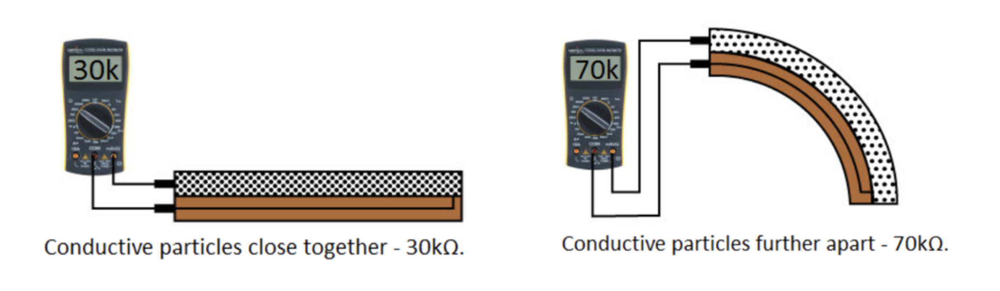
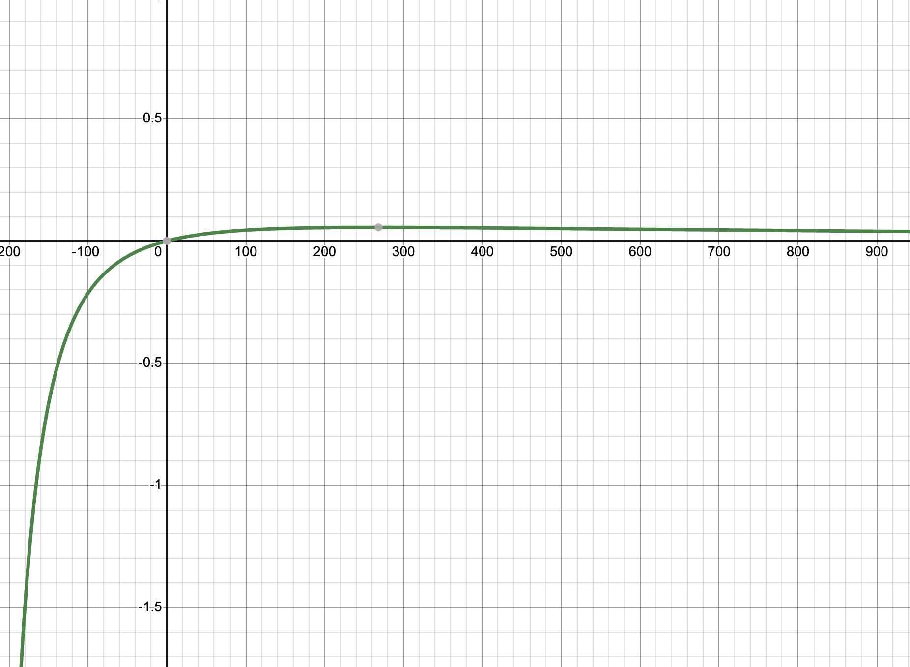
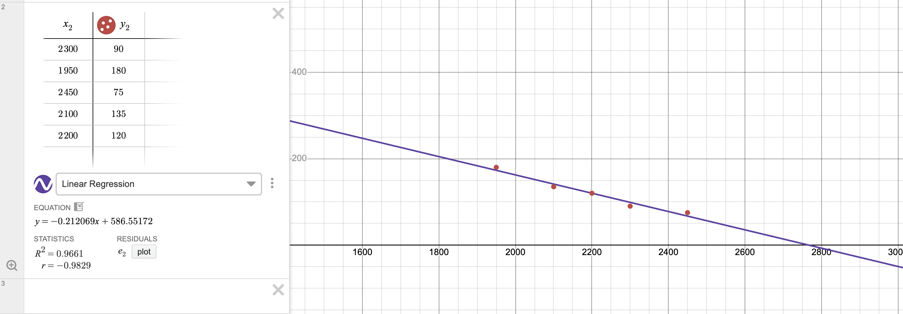
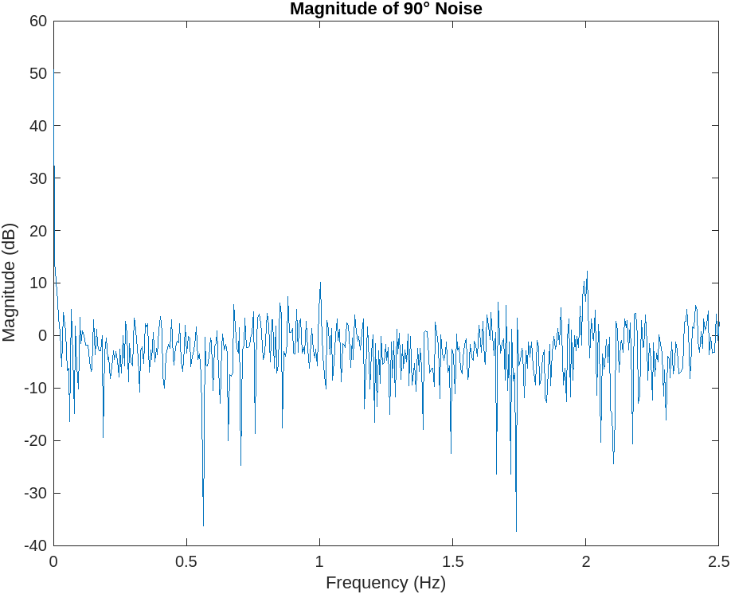
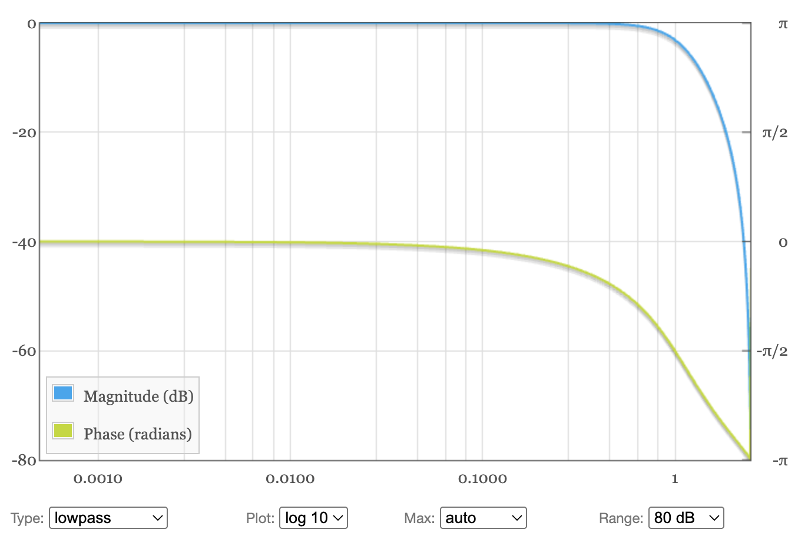
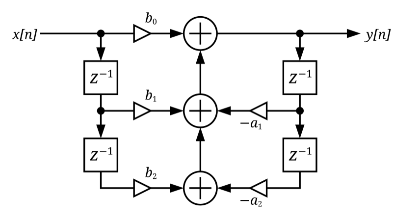
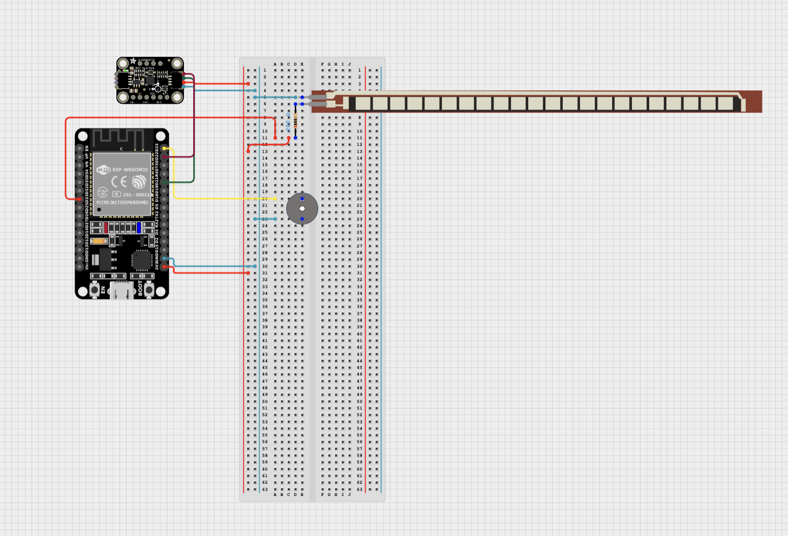

usemathjax: true

# Knee Rehabilitation Device
Replace this text with a brief description (2-3 sentences) of your project. This description should draw the reader in and make them interested in what you've built. You can include what the biggest challenges, takeaways, and triumphs from completing the project were. As you complete your portfolio, remember your audience is less familiar than you are with all that your project entails!

| **Engineer** | **School** | **Area of Interest** | **Grade** |
|:--:|:--:|:--:|:--:|
| Alika G | Woodside Priory | Engineering | Incoming Junior


  
<!-- # Final Milestone

**Don't forget to replace the text below with the embedding for your milestone video. Go to Youtube, click Share -> Embed, and copy and paste the code to replace what's below.**

<iframe width="560" height="315" src="https://www.youtube.com/embed/F7M7imOVGug" title="YouTube video player" frameborder="0" allow="accelerometer; autoplay; clipboard-write; encrypted-media; gyroscope; picture-in-picture; web-share" allowfullscreen></iframe>

For your final milestone, explain the outcome of your project. Key details to include are:
- What you've accomplished since your previous milestone
- What your biggest challenges and triumphs were at BSE
- A summary of key topics you learned about
- What you hope to learn in the future after everything you've learned at BSE


-->
# How it works

## Flex Sensor:

A flex sensor is a variable resistor. When bent, the conductive particles spread apart, increasing the resistance as seen above. 

## Finding a resistor for the flex sensor:

While you can use a variety of resistors for a flex sensor, some will give you a better range than others. From Ohm's law, we know we can write Vin/Vout as $$\frac{R_{1}}{R_{1}+R_{2}}$$, and in this case, the flex sensor is R<sub>2</sub>. I then measured the flex sensor's resistance with a multimeter when it was flat and bent to get its low and high resistances. I wanted to optimise for the largest range, so I wanted to have the highest difference between the ratios of Vin/Vout at the flex sensors' low and high resistance. This makes the equation $$\frac{x}{x+240}-\frac{x}{x+300}$$ (graph is below). Taking the derivative of that, we can find a critical point that is a maximum at $$\sqrt{240\left(300\right)}$$, which is about 268.32. All the measurements are in 1k ohms, so based on these calculations, I chose a 270k ohm resistor.
<div align="center">
  
</div>

## Regression:

After trying many types of regression, I ultimately went with a linear regression, which was pretty accurate for when the knee was 0 to 180 degrees, with less accuracy as you approach the end of that range. Regression means turning a scatter plot into an equation by finding the line of best fit. I did this on Desmos, as it lets you easily toggle between different types of regression. I wanted an R-squared value over 0.95 (R-squared is a metric to see how well the line of best fit fits the points), and I was only able to get that with linear, quadratic, or quartic regression. Quartic wasn't very helpful since I have too few points, so while it was hitting every point, the graph was a bit wonky. Quadratic was the clear best, but because quadratic functions aren't one-to-one, it was creating some difficulties. Linear was both accurate and what the flex sensors regression is supposed to be, between 0 and 180 degrees, according to documentation, so that's what I ended up using.



## Digital Biquad Filter:

In an effort to make my flex sensor data more consistent, I explored ways to create a low-pass filter. The goal of this is to push frequencies past a certain threshold to zero. The first step was recording the raw, unaveraged data from the flex sensor. I used a computer to plot a sample of this data when my knee was at 90° for a few seconds. This data was plotted in magnitude with respect to frequency, meaning it tells you what frequencies are represented in the data and how much of each frequency is there. This is the figure below:
<div align="center">
  
</div>

Based on that graph, I decided the cutoff frequency should be 1 Hz. Deciding the cutoff is a tradeoff between getting rid of variability and still registering significant movements. I then used a computer to model what the filter looked like (see below) and find the right coefficients. 
<div align="center">
  
</div>

A biquad filter uses 6 coefficients: b<sub>0</sub>, b<sub>1</sub>, b<sub>2</sub>, a<sub>0</sub>, a<sub>1</sub> and a<sub>2</sub>. The diagram below shows all the values that go into getting your output (y[n]) from your input (x[n]). In a biquad filter, you also store and use the past 2 input and output values. In the diagram, going back an iteration is represented with z<sup>-1</sup>. All the arrows in the diagram mean multiplication and the + symbols mean addition.
<div align="center">
  
</div>

> [!NOTE]
> I took all my data and did all my filtration after the linear regression, but since it is a linear regression, you can do it either way.


# Second Milestone

<iframe width="560" height="315" src="https://www.youtube.com/embed/kZ0Yr-viwl8?si=Qh_XLWgTdqZkQEg_" title="YouTube video player" frameborder="0" allow="accelerometer; autoplay; clipboard-write; encrypted-media; gyroscope; picture-in-picture; web-share" referrerpolicy="strict-origin-when-cross-origin" allowfullscreen></iframe>

My second milestone consisted of attaching the device to a knee brace (in a temporary manner) and calibrating the threshold values for the sensors based on that. I also added averaging for the sensor data so it would be more consistent and precise. You can choose how many values to average in a moving average (right now it is set at 50). I was able to attach everything with rubber bands and took some time to find the best placement for the flex sensor, which I determined to be under the knee, since it was the most accurate. There weren't too many technical changes from the first milestone. I also added a button to change the threshold of the flex sensor, a power button, and a potentiometer that changes the frequency of the beeps. 

I had a lot of trouble with the regression for converting the flex sensor's raw value to degrees. I tried linear, quadratic, exponential, and logarithmic regressions. In the end I decided that the regression wouldn't work because only the quadratic regression had a pretty high R squared value (it was ~0.99 compared to the ~0.89 of the rest) and since quadratic equations aren't one-to-one, solving for x in terms of y gave me two seperate equations, which I couldn't put together in a peacewise function without it failing the vertical line test. I also tried flipping the x and y values, but then none of the regressions were accurate. Ultimately, I shifted that to a system with 4 pre-set flex sensor threshold levels, where the user could choose between them with a button. 

Next, I hope to get an accurate linear regression and use more advanced averaging or filtering techniques to get more consistent data. I also hope to incorporate more of a user interface-starting with buttons and later potentially having the user be able to input commands from their phones to the device. For example, for the flex sensor threshold levels, right now they are controlled with a button that just cycles through 4 preset values but hopefuly I can make it so in the bluetooth monitor the user can type in something like "Angle threshold: 75" and that would set the device to beep when the knee is at 75 degrees. Overall, my next steps are going to focus on modifications as the base part of my project is done. My 3rd milestone will be sewing and soldering everything, so I want to finish all the additional circuitry or parts my modifications might need before then.


# First Milestone

<iframe width="560" height="315" src="https://www.youtube.com/embed/xQuDBH7mC_g?si=Wa5gteVYbsMu8dR0" title="YouTube video player" frameborder="0" allow="accelerometer; autoplay; clipboard-write; encrypted-media; gyroscope; picture-in-picture; web-share" referrerpolicy="strict-origin-when-cross-origin" allowfullscreen></iframe>

My project is a knee rehabilitation device. It has two main sensors: an accelerometer and a flex sensor. An accelerometer keeps track of the static acceleration values with an internal mesh-like component, and the flex sensor uses variable resistance to measure the angle of bend. It uses these sensors to alert the user (with a beeper) if their knee is bending inwards or once it passes 90 degrees. 

In my first milestone, I was able to put together the flex sensor, accelerometer, beeper, and ESP-32 Arduino with a breadboard. I was able to get data from the flex sensor and accelerometer, and code the buzzer to respond differently to both instruments crossing certain thresholds. I was then able to connect the data to my phone through Bluetooth so I can see the real-time values even when the device is connected to a battery pack.

The main challenge that I faced in this step was getting the accelerometer to connect and send values to my computer. Originally, the accelerometer would just spit out various error codes and junk. In the end, there were a few issues with the initialization of the accelerometer object, which needed to be found in the library since there wasn't any documentation for it.

Next, I hope to place all of this onto the knee compression sleeve and change the thresholds for the flex sensor and accelerometer so the beeping is as precise as possible. I hope to perform linear regression to get the values of the angles from the flex sensor instead of just the regular flex sensor output, which is usually in the 1000s. How I place the accelerometer will also define what the if statement for when the knee is turning inward looks like.

# Schematics 



# Code
Here's where you'll put your code. The syntax below places it into a block of code. Follow the guide [here]([url](https://www.markdownguide.org/extended-syntax/)) to learn how to customize it to your project needs. 

**First Milestone:**
```
//adding needed libraries
#include <Wire.h>
#include <Adafruit_Sensor.h>
#include <Adafruit_LSM6DS33.h>
#include <BleSerial.h>

// creating the Accelerometer and Bluetooth object
Adafruit_LSM6DS33 lsm6ds33 {};
BleSerial ble;


// delaring and initializing variables
const int FlexPin = 33;
const int BuzzerPin = 23;
int FlexValue = 0;


void setup() {
  Serial.begin(115200);
  ble.begin("Alika'sKneeRehabValues");
  pinMode(FlexPin, INPUT);
  pinMode(BuzzerPin, OUTPUT);

  //Accelerometer set up
  lsm6ds33.begin_I2C ();
  Serial.print("Accelerometer range set to: ");
  switch (lsm6ds33.getAccelRange()) {
  case LSM6DS_ACCEL_RANGE_2_G:
    Serial.println("+-2G");
    break;
  case LSM6DS_ACCEL_RANGE_4_G:
    Serial.println("+-4G");
    break;
  case LSM6DS_ACCEL_RANGE_8_G:
    Serial.println("+-8G");
    break;
  case LSM6DS_ACCEL_RANGE_16_G:
    Serial.println("+-16G");
    break;
  }

  Serial.print("Accelerometer data rate set to: ");
  lsm6ds33.setAccelDataRate(LSM6DS_RATE_52_HZ);
  switch (lsm6ds33.getAccelDataRate()) {
  case LSM6DS_RATE_SHUTDOWN:
    Serial.println("0 Hz");
    break;
  case LSM6DS_RATE_12_5_HZ:
    Serial.println("12.5 Hz");
    break;
  case LSM6DS_RATE_26_HZ:
    Serial.println("26 Hz");
    break;
  case LSM6DS_RATE_52_HZ:
    Serial.println("52 Hz");
    break;
  case LSM6DS_RATE_104_HZ:
    Serial.println("104 Hz");
    break;
  case LSM6DS_RATE_208_HZ:
    Serial.println("208 Hz");
    break;
  case LSM6DS_RATE_416_HZ:
    Serial.println("416 Hz");
    break;
  case LSM6DS_RATE_833_HZ:
    Serial.println("833 Hz");
    break;
  case LSM6DS_RATE_1_66K_HZ:
    Serial.println("1.66 KHz");
    break;
  case LSM6DS_RATE_3_33K_HZ:
    Serial.println("3.33 KHz");
    break;
  case LSM6DS_RATE_6_66K_HZ:
    Serial.println("6.66 KHz");
    break;
  }

}

void loop() {   

  //get and print flex sensor data
  FlexValue = analogRead(FlexPin);
  Serial.print("Flex Sensor Value: ");
  Serial.println(FlexValue);
  ble.println("Flex Sensor Value: ");
  ble.println(FlexValue);


  //get and print accelerometer data
  sensors_event_t accel;
  sensors_event_t gyro;
  sensors_event_t temp;
  lsm6ds33.getEvent(&accel, &gyro, &temp);

  Serial.print("\t\tAccel X: ");
  Serial.print(accel.acceleration.x);
  Serial.print(" \tY: ");
  Serial.print(accel.acceleration.y);
  Serial.print(" \tZ: ");
  Serial.print(accel.acceleration.z);
  Serial.println(" m/s^2 ");

  ble.print("\t\tAccel X: ");
  ble.print(accel.acceleration.x);
  ble.print(" \tY: ");
  ble.print(accel.acceleration.y);
  ble.print(" \tZ: ");
  ble.print(accel.acceleration.z);
  ble.println(" m/s^2 ");


  //Check and Buzz if needed 
  if(accel.acceleration.z < 0){
    tone(BuzzerPin, 1000);  
  }  else if (FlexValue > 3200) {
    tone(BuzzerPin, 200);  
    delay(200);
    tone(BuzzerPin, 0); 
  }else{
    tone(BuzzerPin, 0);  
  }
  
  delay(200);

}

```
**Second Milestone:**

```
//adding needed libraries
#include <Wire.h>
#include <Adafruit_Sensor.h>
#include <Adafruit_LSM6DS33.h>
#include <BleSerial.h>
#include <iostream>
#include <cmath>

// creating the Accelerometer and Bluetooth object
Adafruit_LSM6DS33 lsm6ds33 {};
BleSerial ble;

// user can update variables 
const int average = 50;
int AngleDangerLevel = 1; // 4 = 75, 3 = 90, 2 = 120, 1 = 135
int soundVal = 1000;

// delaring and initializing variables
int potValue = 0;
float FlexValue = 0;
float FlexThreshold;
bool on = true;
float flexvaluesarr[average];

// Where pins are 
const int FlexPin = 33;
const int BuzzerPin = 23;
const int topbuttonPin = 35;
const int powerbuttonPin = 4;
const int potPin = 15; 

void setup() {
  Serial.begin(115200);
  ble.begin("Alika'sKneeRehabValues");
  pinMode(FlexPin, INPUT);
  pinMode(BuzzerPin, OUTPUT);
  pinMode(topbuttonPin, INPUT_PULLUP);
  pinMode(powerbuttonPin, INPUT_PULLUP);


  //Accelerometer set up
  lsm6ds33.begin_I2C ();
  Serial.print("Accelerometer range set to: ");
  switch (lsm6ds33.getAccelRange()) {
  case LSM6DS_ACCEL_RANGE_2_G:
    Serial.println("+-2G");
    break;
  case LSM6DS_ACCEL_RANGE_4_G:
    Serial.println("+-4G");
    break;
  case LSM6DS_ACCEL_RANGE_8_G:
    Serial.println("+-8G");
    break;
  case LSM6DS_ACCEL_RANGE_16_G:
    Serial.println("+-16G");
    break;
  }

  Serial.print("Accelerometer data rate set to: ");
  lsm6ds33.setAccelDataRate(LSM6DS_RATE_52_HZ); 
  switch (lsm6ds33.getAccelDataRate()) {
  case LSM6DS_RATE_SHUTDOWN:
    Serial.println("0 Hz");
    break;
  case LSM6DS_RATE_12_5_HZ:
    Serial.println("12.5 Hz");
    break;
  case LSM6DS_RATE_26_HZ:
    Serial.println("26 Hz");
    break;
  case LSM6DS_RATE_52_HZ:
    Serial.println("52 Hz");
    break;
  case LSM6DS_RATE_104_HZ:
    Serial.println("104 Hz");
    break;
  case LSM6DS_RATE_208_HZ:
    Serial.println("208 Hz");
    break;
  case LSM6DS_RATE_416_HZ:
    Serial.println("416 Hz");
    break;
  case LSM6DS_RATE_833_HZ:
    Serial.println("833 Hz");
    break;
  case LSM6DS_RATE_1_66K_HZ:
    Serial.println("1.66 KHz");
    break;
  case LSM6DS_RATE_3_33K_HZ:
    Serial.println("3.33 KHz");
    break;
  case LSM6DS_RATE_6_66K_HZ:
    Serial.println("6.66 KHz");
    break;
  }

  for (int i = 0; i < average; i++){
    flexvaluesarr[i] = analogRead(FlexPin);
  }
}

void loop() {   
  int PowbuttonState = digitalRead(powerbuttonPin);

  while(on){
    //get sensor + convert/average data
    sensors_event_t accel;
    sensors_event_t gyro;
    sensors_event_t temp;
    lsm6ds33.getEvent(&accel, &gyro, &temp);
    float accX;
    float accY;
    float accZ;
    byte topbuttonState = digitalRead(topbuttonPin);

    soundVal = 1.19658*(analogRead(potPin))+100;
    FlexValue = 0;

    accX += accel.acceleration.x;
    accY += accel.acceleration.y;
    accZ += accel.acceleration.z;

    for (int i = 0; i < (average- 1); i++){
      flexvaluesarr[i] = flexvaluesarr[i+1];
      FlexValue += flexvaluesarr[i];
      accX += accel.acceleration.x;
      accY += accel.acceleration.y;
      accZ += accel.acceleration.z;
    }
    flexvaluesarr[average - 1] = analogRead(FlexPin);
    FlexValue += flexvaluesarr[average - 1];
    FlexValue /= average;
    FlexValue = -0.212069*(FlexValue)+586.55172; // linear regression 
    accX /= average;
    accY /= average;
    accZ /= average;

    checkButtons();

    //print flex sensor data

    Serial.print("Flex Sensor Value: ");
    Serial.println(FlexValue);
    // ble.println("Flex Sensor Value: ");
    // ble.println(FlexValue);


    //print accelerometer data

    Serial.print("\t\tAccel X: ");
    Serial.print(accX);
    Serial.print(" \tY: ");
    Serial.print(accY);
    Serial.print(" \tZ: ");
    Serial.print(accZ);
    Serial.println(" m/s^2 ");

    // ble.print("\t\tAccel X: ");
    // ble.print(accX);
    // ble.print(" \tY: ");
    // ble.print(accY);
    // ble.print(" \tZ: ");
    // ble.print(accZ);
    // ble.println(" m/s^2 ");


    //Check and Buzz if needed 
    if(accZ < -2.0 && accY < 1){
      tone(BuzzerPin, soundVal);  
    }  else if (FlexValue > FlexThreshold) {
      tone(BuzzerPin, soundVal-20);  
      delay(100);
      tone(BuzzerPin, 0); 
    }else{
      tone(BuzzerPin, 0);  
    }
  }
  if (PowbuttonState == LOW) { 
    on = !on;
  }
  delay(100);
}

void checkButtons(){
  // check power 
  if (digitalRead(powerbuttonPin) == LOW) { 
    on = !on;
  } 
  // angle level 
  if (digitalRead(topbuttonPin) == LOW) {
      if(AngleDangerLevel < 4){
        AngleDangerLevel ++;
      }else if (AngleDangerLevel == 4){
        AngleDangerLevel = 1;
      }
      Serial.print("Angle Level now: ");
      Serial.println(AngleDangerLevel);
      ble.print("Angle Level now: ");
      ble.println(AngleDangerLevel);
    }
  // converting angle level 
  switch(AngleDangerLevel){
   case 1:
      FlexThreshold = 135;
      break;
   case 2:
      FlexThreshold = 120;
      break;
   case 3:
      FlexThreshold = 90;
      break;
   case 4:
      FlexThreshold = 75;
      break;
  }
  delay(100);
}

```

<!-- # Bill of Materials
Here's where you'll list the parts in your project. To add more rows, just copy and paste the example rows below.
Don't forget to place the link of where to buy each component inside the quotation marks in the corresponding row after href =. Follow the guide [here]([url](https://www.markdownguide.org/extended-syntax/)) to learn how to customize this to your project needs. 

| **Part** | **Note** | **Price** | **Link** |
|:--:|:--:|:--:|:--:|
| Item Name | What the item is used for | $Price | <a href="https://www.amazon.com/Arduino-A000066-ARDUINO-UNO-R3/dp/B008GRTSV6/"> Link </a> |
| Item Name | What the item is used for | $Price | <a href="https://www.amazon.com/Arduino-A000066-ARDUINO-UNO-R3/dp/B008GRTSV6/"> Link </a> |
| Item Name | What the item is used for | $Price | <a href="https://www.amazon.com/Arduino-A000066-ARDUINO-UNO-R3/dp/B008GRTSV6/"> Link </a> |
-->
# Starter Project

<iframe width="560" height="315" src="https://www.youtube.com/embed/CEAYpI-ZN_E?si=CcBUxAGMJ-E9xZPf" title="YouTube video player" frameborder="0" allow="accelerometer; autoplay; clipboard-write; encrypted-media; gyroscope; picture-in-picture; web-share" referrerpolicy="strict-origin-when-cross-origin" allowfullscreen></iframe>

**Description:**
My starter project was the Retro Arcade Console. It is a roughly hand-sized gaming console with 5 vintage games, brightness and sound settings, and 6 buttons: one for each direction, one for exiting, and one for selecting. I first soldered all the components, then I put the battery pack on part of the casing, and lastly, I assembled the casing. It was pretty straightforward and a fun way for me to revive my soldering skills. I didn't face any large challenges making this. 

**Next Steps:**
Next, I will be moving on to my intensive project: the knee rehabilitation device. This project taught me how to use a multimeter to test for short circuits, which will be very helpful as I move on to my larger, more complex project.

# Other Resources
- [Cirkit Designer](https://app.cirkitdesigner.com/)
- [Instructables](https://www.instructables.com/How-to-Make-FLEX-Sensor-at-Home-DIY-Flex-Sensor/)
- [Wikipedia on Digital Biquad Filters](https://en.wikipedia.org/wiki/Digital_biquad_filter)
- [Biquad Calculator](https://www.earlevel.com/main/2021/09/02/biquad-calculator-v3/)
